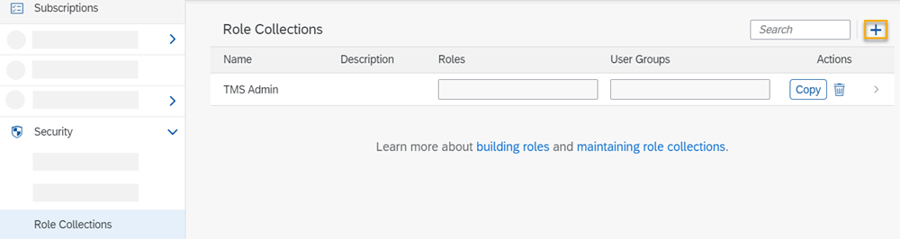
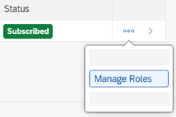
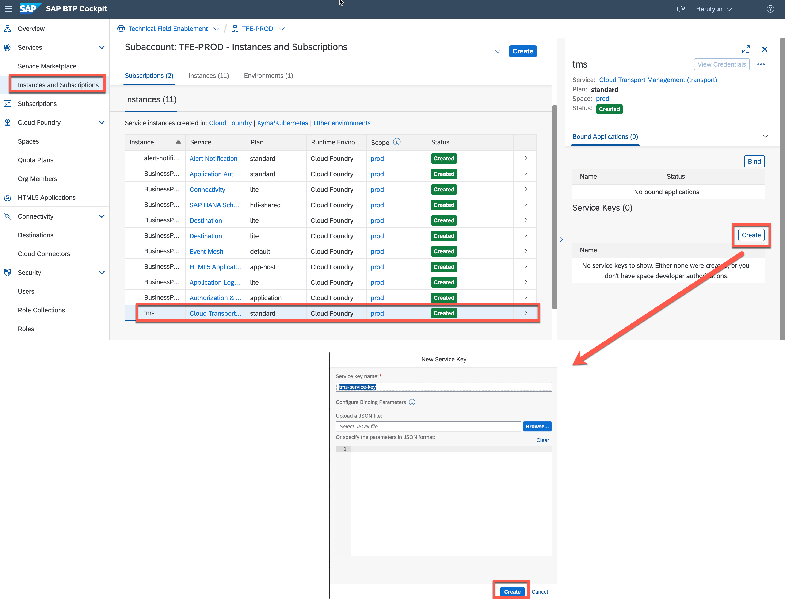
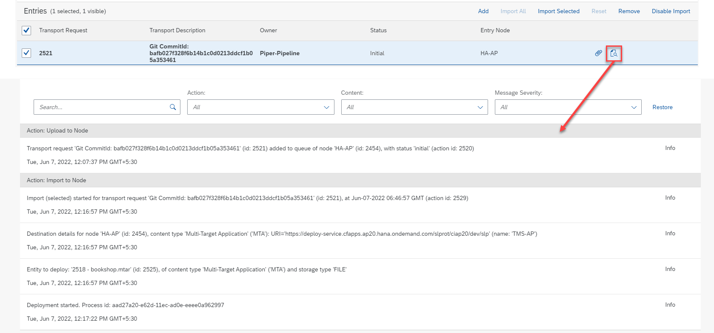

# Setup Cloud Transport Management Service

### You will learn
- How to enable SAP Cloud Transport Management Service
- How to configure a SAP Cloud Transport Management Service
- How to integrate SAP Cloud Transport Management into your CI/CD pipeline

testa

> ### Prerequisites
> - You have developed a CAP application and prepared for deployment. 
> - Entitlement for Cloud Transport Management 

## Enable SAP Cloud Transport Management Service

>Note: you can skip this step, if you used previously the Booster to initiate the Subaccount

1. Go to your subaccount in SAP BTP
2. Navigate to the Service Marketplace
3. Find the Cloud Transport Management Service and subscribe to the Service. In the subsequent dialog, select the saas-application plan and create
        
4. Create 2 new role collections for the Cloud Transport Management
 
   - To create a new role collection, in your subaccount, choose Security  Role Collections.
   - Choose ... (Create New Role Collection).
     
     

   - Enter a name (*TMS Import Operator*) for the new role collection, and choose Create. 
     
     

   - Repeat the previous steps to create the *TMS Admin* role collection.
   - The new role collections are added to the list.
     
     

   - In your subaccount, choose Services  > Instances and Subscriptions.
  
     
    
   - On the Subscriptions tab, in the Cloud Transport Management row, choose ... (Actions) and Manage Roles.
  
     

   - The default role templates are displayed
  
     
  
   - Assign the  Cloud Transport Management roles to the role collections
     * ImportOperator > TMS Import Operator
     * Administrator > TMS Admin
       
       
5. Find your user and choose Assign Role Collection
        
6.  Assign the Role Collection **"TMS Import Operator, TMS Admin"** to your user
    
       

## Create Transport Destinations
In SAP Cloud Transport Management, transport destinations are used to address the target end point of a deployment process.

You create a destination in SAP BTP Cockpit of the subaccount in which you are subscribed to SAP Cloud Transport Management.

Note that SAP Cloud Transport Management only supports HTTPS destinations.

- Go to Subaccount where you activated the Cloud Transport management
- Create a Destinations pointing to other region subaccount
  
    | Destination  | URL                                                                                         | Authentication       | User/Password                             |
    | ------------ | ------------------------------------------------------------------------------------------- | -------------------- | ----------------------------------------- |
    | **TMS-AP**   | https://deploy-service.cfapps.< default-domain >/slprot/< myorg-ap >/< myspace-ap >/slp     | Basic Authentication | username & password of the technical user |
    
    

    > Instead of Basic Authentication, it is also possible to use OAuth2Password Authentication. More details can be found [here](https://help.sap.com/viewer/7f7160ec0d8546c6b3eab72fb5ad6fd8/Cloud/en-US/c9905c142cf14aea86fe2451434faed9.html)

## Create Transport Nodes
In Cloud Transport Management, transport nodes represent source and target end points of a deployment process - for example, a Cloud Foundry subaccount. Transports take place between transport nodes.

You can use the Transport Landscape Wizard to configure the transport nodes and transport routes of simple transport landscapes.

   - 'Go to Application' link is available that allows you to start the user interface of SAP Cloud Transport Management, as shown in the image below:
   

   - Start the Landscape Wizard and Choose Two-Node Landscape and go to next step. 
     

   - Provide the details of Nodes:
  
    | Node   | Name | Allow Upload | Forward Mode | Content Type     | Destination |
    | ------ | ---- | ------------ | ------------ | ---------------- | ----------- |
    | Node 1 | HA-US   | false         | Auto         |  |      |
    | Node 2 | HA-AP | true        | Auto         | Multi-Target App | TMS-AP    |
  
    Here HA-US is source node of a transport, you can leave the Content Type and Destination fields deselected

   - Give a name for the transport route: **route_us_ap**
    
      
   - After successfully finishing the step, you will find the newly defind Nodes in **Landscape Visualization**
  

## Integrating SAP Cloud Transport Management to CI/CD pipeline
   With this integration, your fully qualified Multitarget Application (MTA) archive gets automatically handed over to the SAP Cloud Platform Transport Management service for deployment. 
   
1. Create Service Instance of Cloud Transport Management
   
   - Go to "Instances and Subscriptions" and create new service instance of **Cloud Transport Management** Service Plan: **standard**
   

   - Create **Service Key** (name: tms-service-key)
   

  
2. Create TMS Credentials in SAP Continuous Integration and Delivery Service
  - Open CI/CD Service and go to "Credentials" Tab
  - Create new credential by clicking on "+"
  
    

  - Give a name for credential: **"tms"**
  - Choose as a Type: **"Cloud Foundry Service Key"**
  - Past the copied JSON from previous step and create the credential
    

3. Activate the "Upload to TMS" in our pipeline step
   - In the Jobs tab of SAP Continuous Integration and Delivery, select your job and choose to Edit
   - Scroll down to Upload to Cloud Transport Management step and  switch on
   - Enter the source Node Name, which was created in previous section(Create Transport Nodes). Here I am Uploading to **HA-AP**, since **HA-US** Node/Subaccount is part of Development Landscape and is delivered by CI.
   - Select the Service Key and save.
   
   
## Verify your build and transport
- In the Jobs tab of SAP Continuous Integration and Delivery, select your job and choose Trigger Build.

- Wait until the job has finished and verify that the build tile is marked as successful.

-  Import queue of Cloud Transport Management
    
    After Pipeline finishes the steps (Build > Deploy to Dev > Upload TMS), we will find the build results (MTAR) in Cloud Transport Management **queue of HA-AP Node**
    
    - Open Cloud Transport Management and go to **HA-AP** Node
    - You will find one entry in a queue, which is the MTAR archive created by CI/CD Service
    

- Import the changes to AP Region Subaccount
    - Select the entry and press in **"Import Selected"**
    - After Approval, it will run a deployment to QA Subaccount and forward the MTAR to upcoming Node configured in the route. We didn't configure further routes. 
  
      

    - Meanwhile the deployment is running, you can check the **Logs** of this transport entry. In case of issues during the deployment, you can find the details of failure in this log.

      

    - After finishing the import you will find the Application deployed in your **AP Region Subaccount**

  >Additionally to manual import, you can schedule automatic deployment based on defined schedule. E.g. Every week on certain day and time.
  

## Transport routes for Productive Landscape
This section is relevant, if you are transporting to Productive Landscape. 

The transport routes are used to connect transport nodes, so we need a different transport nodes to represent your productive landscape.  To create transport nodes, we need a transport destinations.  

1. Create a destinations for productive subaccount something as follows 

    | Destination     | URL                                                                                     | Authentication       | User/Password                             |
    | --------------- | --------------------------------------------------------------------------------------- | -------------------- | ----------------------------------------- |
    | **TMS-AP-PROD** | https://deploy-service.cfapps.< default-domain >/slprot/< myorg-ap >/< myspace-ap >/slp | Basic Authentication | username & password of the technical user |
    | **TMS-US-PROD** | https://deploy-service.cfapps.< default-domain >/slprot/< myorg-ap >/< myspace-us >/slp | Basic Authentication | username & password of the technical user |

2. Choose `Transport Nodes` from the navigation pane, and choose + (Create a new node). We need a Transport Nodes for each region
  
    | Name       | Allow Upload | Forward Mode | Content Type     | Destination |
    | ---------- | ------------ | ------------ | ---------------- | ----------- |
    | HA-US-PROD | false        | Auto         | Multi-Target App | TMS-US-PROD |
    | HA-AP-PROD | false        | Auto         | Multi-Target App | TMS-AP-PROD |

    

3. Choose `Transport Routes` from the navigation pane, and choose + (Create a route).

   On the following screen, enter a name for the transport route, and a description (optional). Choose the source and the target nodes from the existing transport nodes.

    | Name       | Source Node | Target Node |
    | ---------- | ------------ | ------------
    | HA-US-PROD | HA-AP        | HA-US-PROD        
    | HA-AP-PROD | HA-AP        | HA-AP-PROD        
    

4. Choose  `Landscape Visualization` from the navigation pane. We could see the transport nodes and transport routes displayed on the canvas as follows.

6. Import the changes to production region subaccount by navigating to relevant nodes and choosing **"Import Selected"**

7. After finishing the import you will find the Application deployed in your **Productive Region Subaccounts**

You have now successfully created a SAP Cloud Transport Management routes and integrated into CI/CD pipeline.