# Setup Amazon Aurora Global Database Cluster

### You will learn
  - How to set up Amazon Aurora Global Database Cluster
  
> ### Prerequisites
> - AWS subscription


## Create an Amazon Aurora Instance
To create your first instance of `Amazon Aurora Global Database Cluster`, you need to follow these steps:
If you already have an Amazon Aurora Cluster, you can also do an inplace upgrade adding a new region. but in our scenario, we are going to create a brand-new cluster

1. Open Amazon RDS Management console and select databases then click on create database.
   
   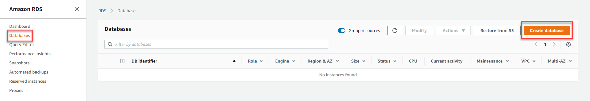

2. Select the database creation method as `Standard Create` and Engine options as `Amazon Aurora`,
 then Edition as `Amazon Aurora PostgreSQL-Compatible Edition`              
    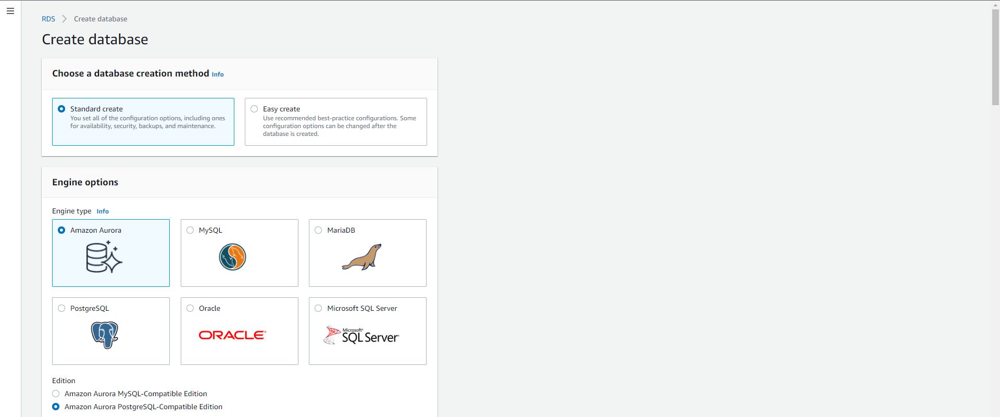

    **Note**: Currently Amazon Aurora [multi-master](https://aws.amazon.com/about-aws/whats-new/2019/08/amazon-aurora-multimaster-now-generally-available) replication feature is available on MySQL-Compatible Edition, but the CAP applications does not support MySQL ([Database Support in Java](https://cap.cloud.sap/docs/java/development/#database-support)) so we have to go with PostgreSQL. 
    
3. Then choose the latest PostgreSQL Version. On the righthand side you will see the different versions compatible with Global Database. We are good there with the version selected.

    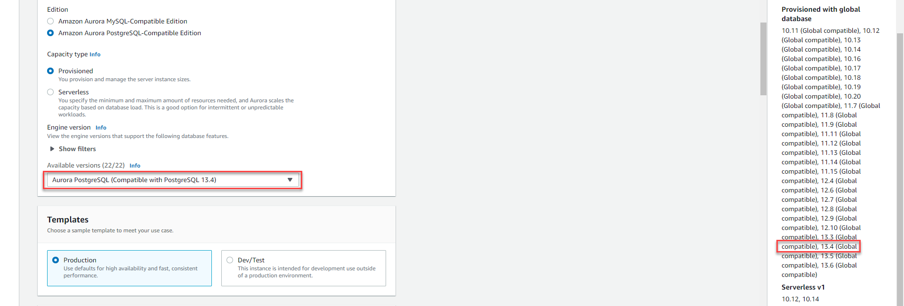

4. Change the database cluster name to `demo-region-1`, so that we can easily identify which region is primary and secondary. Then add the database credentials.
**Note**: Global Databbase spans multiple regions, it is important that when you are creating a primary region make sure you are in appropriate region. (Top right-hand corner we are in North Virginia Region).
    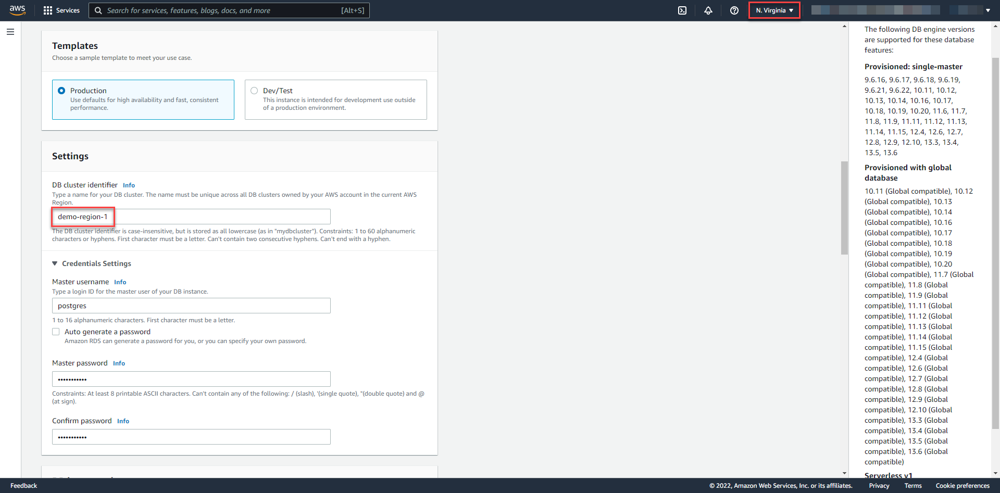

5. In Availability & Durability section select *Don't Create an Amazon Aurora Replica*. We will create read replica later in different region
   
    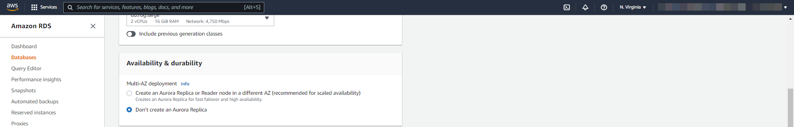

6. Scroll down connectivity section and make sure `Publicly accessible` option is enabled, else some versions not possible to change later. This leads to connectivity issues.
    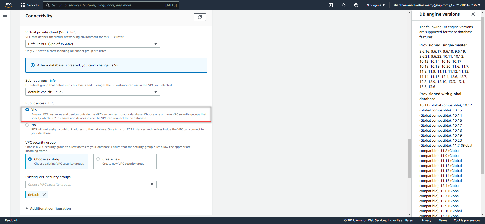
  
7. Keep other sections default and move down to Additional Configurations. Then set the initial database name and remove the Enable deletion protection.
    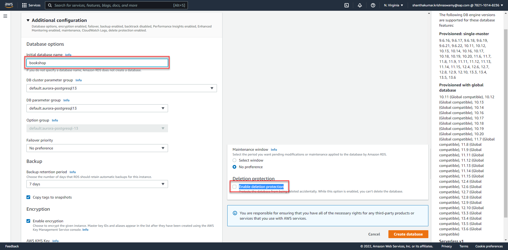

8. Finally click on create database. It takes some time to complete. 

    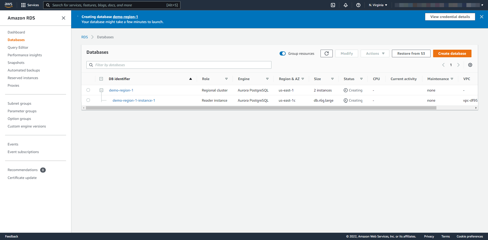
9.  Finally you could see the demo-region-1 available with read and write endpoints.
   
    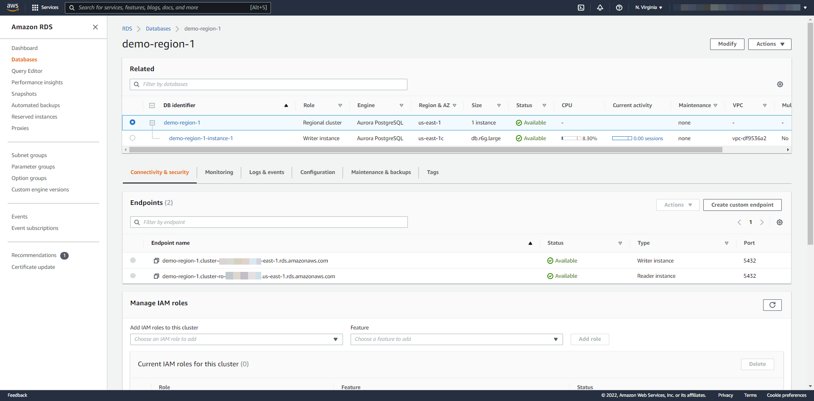

**Creating DB cluster with cross-region read replicas**

10.  To create DB cluster, select the Regional cluster and select on actions and then add AWS Region
    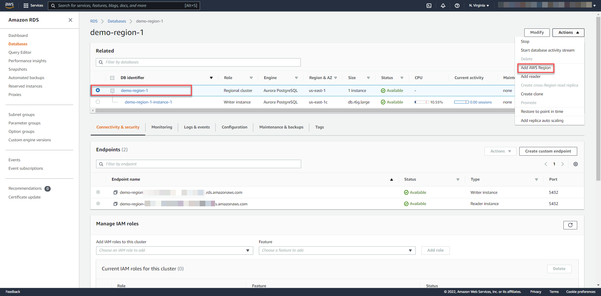

11. Specify the Global database settings and AWS region
    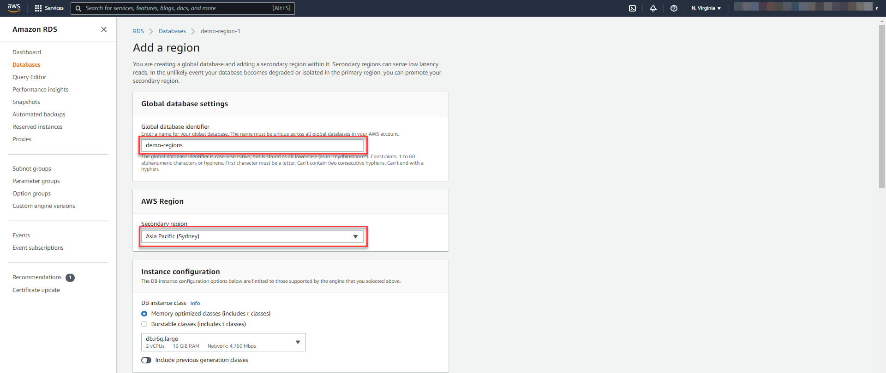

12. Scroll down connectivity section and make sure Publicly accessible option is enabled
 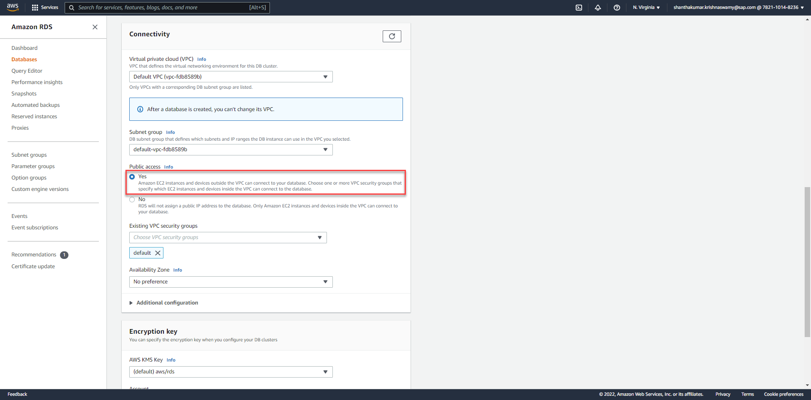

12. Keep other sections default and move down to Additional Configurations. Then modify the instance and Cluster Identifier
    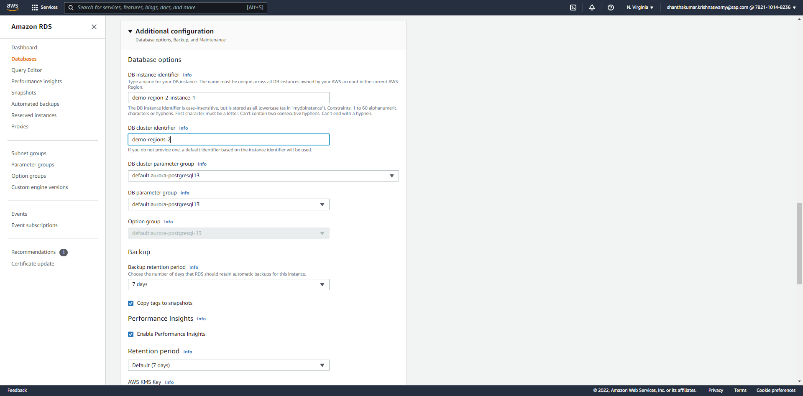

13. Finally click on create database and check the endpoints
    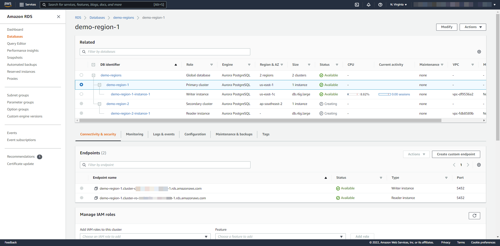

## Managing Replicas

Using the Amazon RDS console, you can quickly access the status of your DB cluster and respond to Amazon Aurora recommendations.

 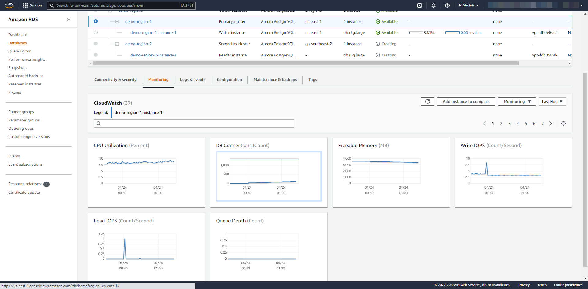

On very rare occasions, your Amazon Aurora Global Database might experience an unexpected outage in its primary AWS Region. If this happens, your primary Amazon Aurora DB cluster and its writer node aren't available, and the replication between the primary cluster and the secondaries ceases. To minimize both downtime (RTO) and data loss (RPO), you can work quickly to perform a cross-region failover and reconstruct your Amazon Aurora Global Database

To start the MANUAL failover process on your Amazon Aurora Global Database, Choose Fail over Global Database from Actions menu and Choose the secondary Amazon Aurora DB cluster that you want to promote to primary.

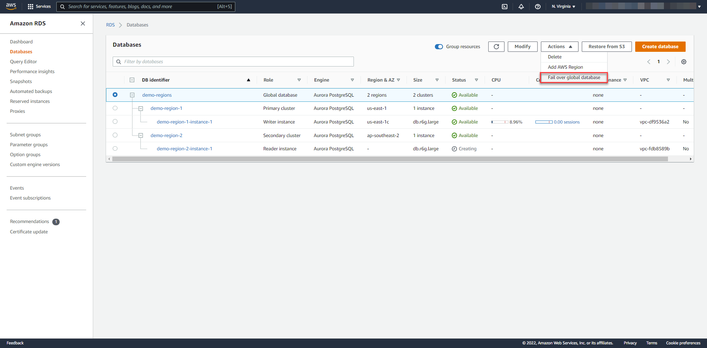

## Testing the connection

Connection to an Amazon Aurora Global Database depends on whether you need to write to the database or read from the database. 

For read-only requests, you connect to the reader endpoint and DML or DDL statements connect to the cluster endpoint for the primary cluster.

There are different ways to check the DB connection. Make sure connections are working in **both the regions**.

**Using Powershell :**
```
Test-NetConnection -ComputerName demo-region-1.cluster-ro-----------.us-east-1.rds.amazonaws.com -Port 5432
```

**Using DBeaver :** [Download](https://dbeaver.io/download/) and install the community edition of DBeaver and connect to different regions.

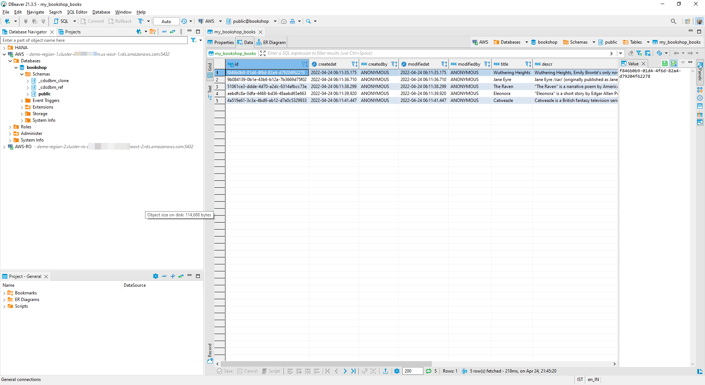


In-case of connectivity issues, check the `Publicly accessible` option enabled and VPC Security Groups inbound routes.
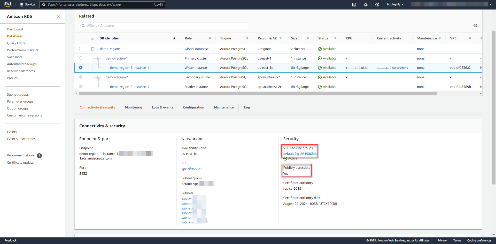

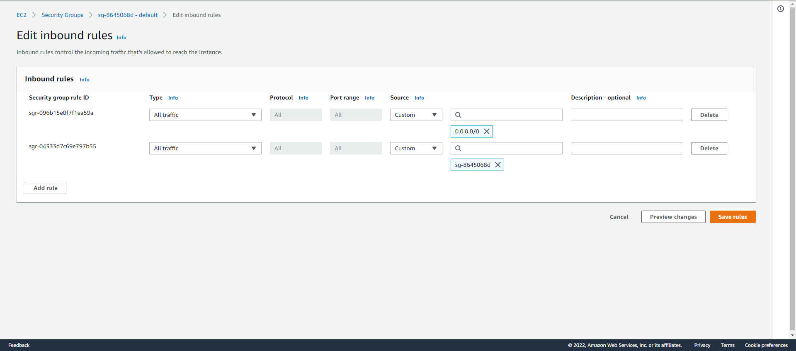

**Monitor the Global Database**

Access the Amazon RDS console and Monitor the Global Database ( [more details](https://awsauroralabsmy.com/global/monitor/) ). 
    

Now you have an Amazon Aurora PostgreSQL-Compatible Edition with Global Database configured. In the next tutorial, learn about developing resilient CAP Application to access your database instance.
