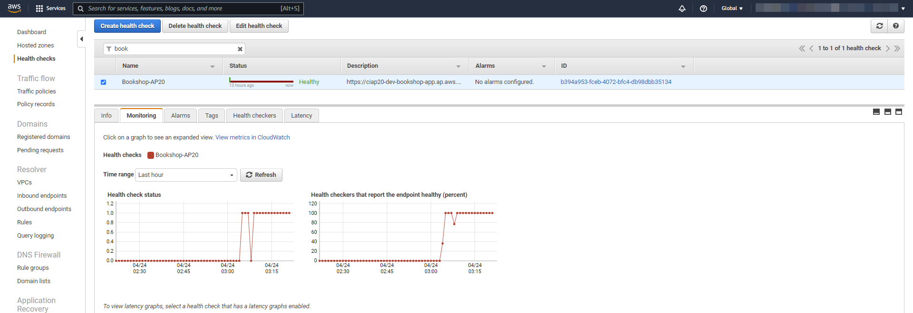
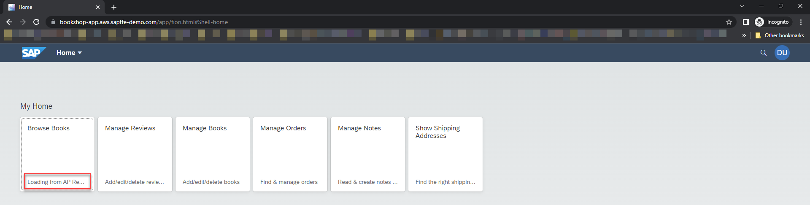
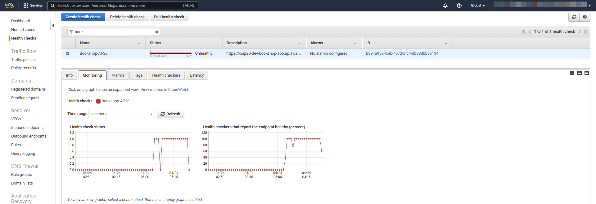
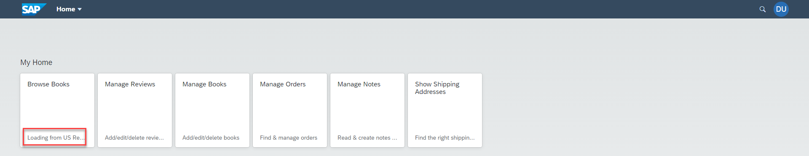
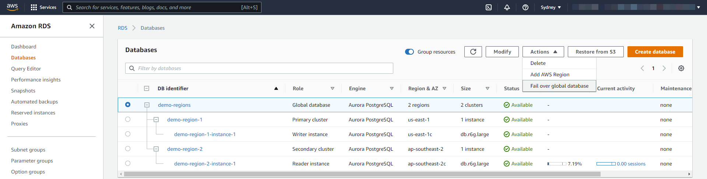

# Testing the application

### You will learn
- Testing CAP application for intelligent routing
- Testing Fast failover with Amazon Aurora Global Database

> ### Prerequisites
> - Make sure all the previous steps are completed and application end points are working.

##  Failover in application layer

In the initial situation, CAP applications are online in both the regions and your primary region (Primary enpoint in Traffic Policy) will process the requests. Then you simulate a situation where the primary regions is not available by stopping the application in primary region. Thus, Health check endpoint will no longer receive the expected response from the call (HTTP 200) and will consider the primary region as offline.

Depending on the Failover & DNS TTL settings in Amazon Route 53 Traffic policy settings, the Secondary Region (secondary endpoint in Traffic Policy) will process your upcoming requests after a certain time. The sender is effectively unaware of the process in the background, as it sends the requests to a domain regardless of the reachable regions in the background.

**Failover in application router module**

1. Go to the AWS Console and look at the Health check Endpoint. You should see that primary region considered as Healthy.


    Also, you can see, the primary region handles the request based on the Amazon Route 53 Traffic Policy configuration.

   

    
2. Let's now simulate that the primary region application is not available anymore. For testing purpose, you can stop the application using the terminal.
    ```
    cf stop bookshop-app
    ```

3. Check the status of the endpoints in the Amazon Route 53 Health Check Endpoint. Depending on your failover settings in the Amazon Route 53 Traffic Policy configuration it takes a few moments until the primary region is considered as Unhealthy.


4. Go back to your browser and refresh the page. 
   
   
   
   As you can see, the secondary region handles the request, since Amazon Route 53 considers the primary region as not reachable.

**Failover in application backend module**

Let's now simulate the same scenario like before for backend Module (bookshop-srv module).

  1.  Start the router module since we stopped in previous test. Also check the Amazon Route 53 profile, both regions are considered as online.
        ```
        cf start bookshop-app
        ```  

  2. Let's now simulate that the primary region Backend Module is not available anymore. For testing purpose, you can stop the application using Terminal.
   
        ```
        cf stop bookshop-srv
        ```  

  3. We could see the same result as before. In Amazon Route 53 Traffic Policy, primary region is considered as Unhealthy and refreshing the browser handles the request from secondary region.


## Failover in database layer

We have a Amazon Aurora Global Database is created with a primary Amazon Aurora cluster in one region and a secondary Amazon Aurora cluster in a different region.  

If the primary instance in a DB cluster using single-master replication fails, Amazon Aurora automatically fails over to a new primary instance by promoting an existing Amazon Aurora Replica to the new primary instance or by creating a new primary instance. 

If the DB cluster has one or more Aurora Replicas, then an Aurora Replica is promoted to the primary instance during a failure event. A failure event results in a brief interruption, during which read and write operations fail with an exception. However, service is typically restored in less than 120 seconds, and often less than 60 seconds. 

Let's now simulate that the primary region is having an issue and Promoting the secondary Aurora PostgreSQL cluster using planned failover process

During the planned failover process, the cluster in the primary AWS Region will be demoted to a secondary and becomes read-only. To perform the managed planned failover for Amazon Aurora Global Database using the console, complete the following steps:

1. On the Amazon Relational Database Service (Amazon RDS) console, choose Databases.
2. Select the Amazon Aurora Global Database you want to fail over.
3. On the Actions menu, choose Fail over Global Database.

4. Choose the secondary Amazon Aurora DB cluster that you want to promote to primary.
5. Choose Fail over the Global Database.
6. The Status column of the database list shows the state of each Amazon Aurora DB instance and Amazon Aurora DB cluster during the failover process.
7. After takeover, application works as before without any change.  

Great job! You have configured the resilient CAP application using Aurora Global Database with Amazon Route 53.
