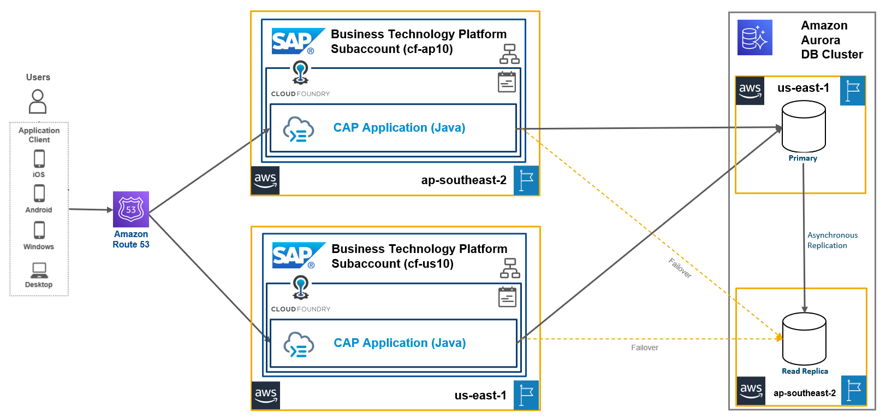

# Distributed Resiliency of CAP applications using Amazon Aurora (Read Replica) with Amazon Route 53 

This repository contains code samples and step-by-step instructions to enable *Distributed Resiliency of CAP applications using Amazon Aurora with Amazon Route 53*.

## Description

In this scenario, we are going to deploy the CAP applications to multiple regions with active-active setup. The Amazon Aurora Global Data Base Cluster is configured with cross-region read replica. Amazon Route 53 is used for routing the request to different regions subaccounts based on the maintained configurations.

This use case is recommended for customers having SAP BTP subscriptions on AWS and building transactional CAP applications with data availability across the regions. This use case will not address the data latency issue across the regions and not recommended for real-time analytics solutions.

**Approximate RPO (Recovery Point Objective)**
| Traffic Routing | Presentation/Web tier | Application tier | Data tier                                      |
| --------------- | --------------------- | ----------------- | ---------------------------------------------- |
|  Based on DNS Time-to-Live (TTL) of the Amazon  Route 53 profile. Setting a TTL of 60 or 120 seconds is a common choice for a rapid failover mechanism |Based on the Routing|Based on the Routing| Promoting an existing Replica takes less than 120 seconds, often less than 60 seconds and recreating primary instance takes less than 10 minutes |

## Solution Architecture
The conceptual solution diagram below shows a hybrid and multi-cloud architecture design, which integrates applications with SAP BTP services and solutions on multiple cloud platforms.

This mission shows how to develop a Java-based resilient CAP application on SAP Business Technology Platform Cloud Foundry runtime using Amazon Route 53 and Amazon Aurora Global Database.

## Challenge
Failures in applications cannot be avoided. Therefore, the time between a failure and its correction, as well as the frequency of failures, must be reduced. 
- Automatic Failover for CAP applications
- Reducing Latency for CAP applications Globally (e.g. US users acessing CAP applications in Australia in a failover scenario)
- Load balancing between CAP application tenants (increasing throughput of your tenant beyond scale-up capabilities)
  
## Outcome

A cloud native integration pattern that incorporates SAP BTP and AWS cloud platform to eliminate downtime, reduce global latency and increase throughput. The approach can be applied to other BTP services in same way. Check the [Further Reading Section](./README.md#furtherreading) for other examples.

## Solution
- Configuring Amazon Aurora Global Database 
- Using your own domain for SAP CAP Application using the SAP Custom Domain Service
- Configuring Amazon Route 53 and different Amazon Route 53 profiles to decouple connection information
  
## Requirements

The required systems and components are:

- SAP BTP enterprise account
- 2 SAP BTP subaccounts: e.g. one in AP10, another in US10
- AWS cloud platform subscription
- An own domain

Entitlements/Quota required in your SAP Business Technology Platform Account:

| Service                     | Plan             | Number of instances |
| --------------------------- | ---------------- | ------------------- |
| Custom Domain Service       | Custom Domain    | 2                   |
| Authorization and Trust Management Service      | broker    | 2                   |

Subscriptions required in your SAP Business Technology Platform Account:

| Subscription               | Plan                                                   |
| -------------------------- | ------------------------------------------------------ |
| SAP Business Application Studio|  Standard (Application)                                |

## Table of Contents

[Step 1: Setup Amazon Aurora Global Database](./01-Setup%20AWS%20Aurora/README.md)

[Step 2: Deploy CAP Java project to different regions](./02-Setup%20CAP%20Application/README.md)

[Step 3: Map Custom Domain Routes](./03-Configuring%20Custom%20Domains/README.md)

[Step 4: Setup Amazon Route 53](./04-Setup%20Route53/README.md)

[Step 5: Test Failover Scenario](./05-Test%20Failover%20Scenario/README.md)

[Step 6: Additional Findings and Analyses](./06-Additional%20Findings/README.md)

##  Further Reading

GitHub: [BTP Cloud Integration Intelligent Routing](https://github.com/SAP-samples/btp-cloud-integration-intelligent-routing)

GitHub: [High Availability of SAP Launchpad service](https://github.tools.sap/btp-use-case-factory/launchpad-ha)

Blogpost: [Architecting Solutions on SAP BTP for High Availability](https://blogs.sap.com/2021/08/17/architecting-solutions-on-sap-btp-for-high-availability/) by [Murali Shanmugham](https://people.sap.com/muralidaran.shanmugham2)

## Known Issues
This scenario will not address the multi-region latency issue, since the application will access the DB from across region, which may lead to latency issue.

## How to obtain support

[Create an issue](https://github.com/SAP-samples/cap-distributed-resiliency/issues) in this repository if you find a bug or have questions about the content.
 
For additional support, [ask a question in SAP Community](https://answers.sap.com/questions/ask.html).

## Contributing
If you wish to contribute code, offer fixes or improvements, please send a pull request. Due to legal reasons, contributors will be asked to accept a DCO when they create the first pull request to this project. This happens in an automated fashion during the submission process. SAP uses [the standard DCO text of the Linux Foundation](https://developercertificate.org/).

## License
Copyright (c) 2022 SAP SE or an SAP affiliate company. All rights reserved. This project is licensed under the Apache Software License, version 2.0 except as noted otherwise in the [LICENSE](LICENSES/Apache-2.0.txt) file.
