# Custom Domains with SAP CAP applications

### You will learn
- How to create a custom domain service instance and domain
- How to sign a certificate and upload the certificate chain to Cloud Foundry
- How to configure your DNS service for CNAME
- How to configure a CAP application to use custom domains

> ### Prerequisites
> - Make sure you have the custom domain quota. 

**Important:** The following steps need to be executed for both of the subaccounts. 

## Create custom domain service instance and domain

>**Important**: This tutorial uses the CF CLI plugin to create a custom domain within a Cloud Foundry organization. Alternatively, you can also use the new UI-based SAP BTP SaaS offering for managing your custom domains [click here](https://help.sap.com/docs/CUSTOM_DOMAINS/6f35a23466ee4df0b19085c9c52f9c29/4f4c3ff62fd2413089dce8a973620167.html?locale=en-US). This new approach becomes especially relevant for customers using SaaS solutions provisioned in extension landscapes like eu10-003. 

1. Install the Cloud Foundry CLI and make sure you have chosen the right API endpoint (one of the subaccounts). Follow [this tutorial](https://developers.sap.com/tutorials/cp-cf-download-cli.html) in order to do so. 

2. Install the [custom domain plugin for the Cloud Foundry CLI](https://help.sap.com/viewer/65de2977205c403bbc107264b8eccf4b/Cloud/en-US/9f98dd0fcf9447019f233403f4ca60c1.html). 

3. Copy the **API Endpoint** and **Org Name** of your first subaccount to your clipboard. The information can be taken from the subaccount overview in the SAP BTP Cockpit. 
    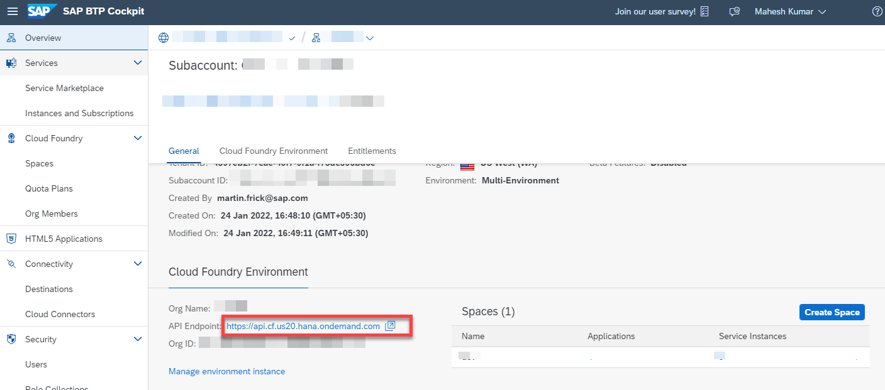

4. Log in to the right Cloud Foundry space that you have created in the previous exercises using the following command. Insert the corresponding **API Endpoint** from the previous step. 

    ```
    cf login -a <API_ENDPOINT>
    ```

5. Create an instance of the [Custom Domain Service](https://help.sap.com/viewer/product/CUSTOM_DOMAINS/Cloud/en-US) using the following command.

    ```
    cf create-service INFRA custom_domains customdomain
    ```

6. Register your custom domain.

    ```console
    cf create-domain <cloudfoundry_org> example.com
    ```
    > Note: Instead of example.com use your own domain that you have bought. Replace the <cloudfoundry_org> with the **Org Name** you have copied from the subaccount overview in Step 3. 

7. Check if the domain was registered.
    
    ```console
    cf domains
    ```

8. Generate a new private and public key pair for this domain.
   
    ```console
    cf custom-domain-create-key keyazuretemp "CN=*.example.com, O=<Organization e.g. SAP>, L=<Location e.g. Walldorf>, C=<Country e.g. DE>" "*.example.com"
    ```

    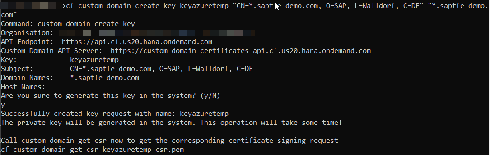

9.  Download certificate signing request corresponding to the new key.

    ```console
    cf custom-domain-get-csr keyazuretemp keyazuretemp.pem
    ```

    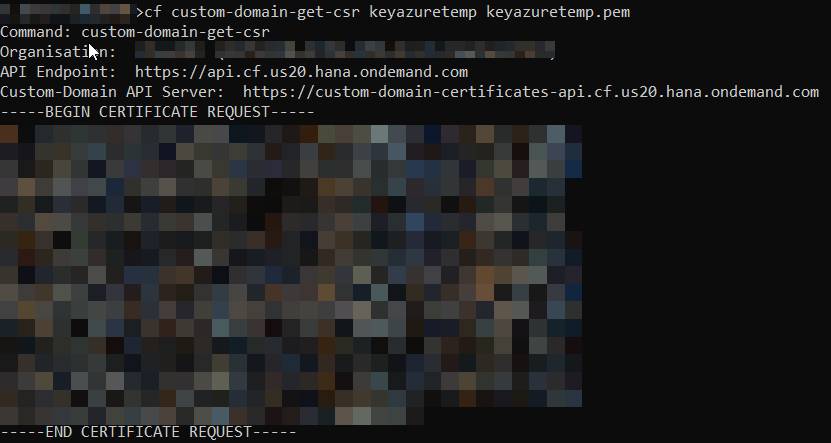

    > Note: The file key1_unsigned.pem is downloaded to your current working directory. Use `pwd` (for Linux/macOs) or `dir` (Windows) to find out the current working directory.

10. Install certbot client on local machine. 

    - for **Windows**: Download the latest version of the Certbot installer for Windows at https://dl.eff.org/certbot-beta-installer-win32.exe. Run the installer and follow the wizard. The installer will propose a default installation directory, C:\Program Files(x86)

    - for macOS: execute ```brew install certbot``` to install the certbot client. 
    > for all others: Go to https://certbot.eff.org/lets-encrypt/osx-other and choose "My HTTP website is running on **none of the above** on **choose your OS**. 

    > **IMPORTANT**: The output of the certbot commands will look slightly different depending on your OS. Screenshots were taken with macOS. 

11. Sign the certificate signing request (with a domain bought). 

    **Windows (console with administrative rights might be required):**
    ```console
    certbot certonly --manual --preferred-challenges dns --server "https://acme-v02.api.letsencrypt.org/directory" --domain "*.example.com" --email your.mail@example.com --csr keyazuretemp.pem --no-bootstrap --agree-tos
    ```
    **macOS**
    ```console
    sudo certbot certonly --manual --preferred-challenges dns --server "https://acme-v02.api.letsencrypt.org/directory" --domain "*.example.com" --email your.mail@example.com --csr keyazuretemp.pem --no-bootstrap --agree-tos
    ```

    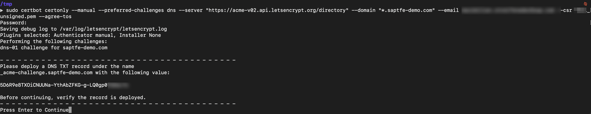

    > Don't forget to fill in your domain and mail address instead of example.com! You now have to proof that you are in control of the domain - certbot is now executing a DNS challenge. 

12. Open a new broswer tab, go to the management interface of your domain (here [Azure Portal](http://portal.azure.com)) and navigate into the DNS zone of your bought domain. 

    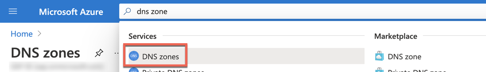
    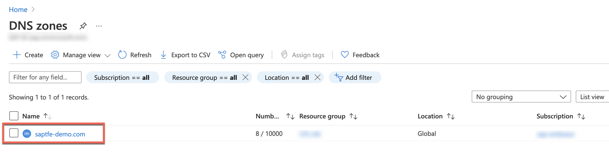

13. **Create a new record set** and enter the details that the certbot command (Step 8) has printed out. 

    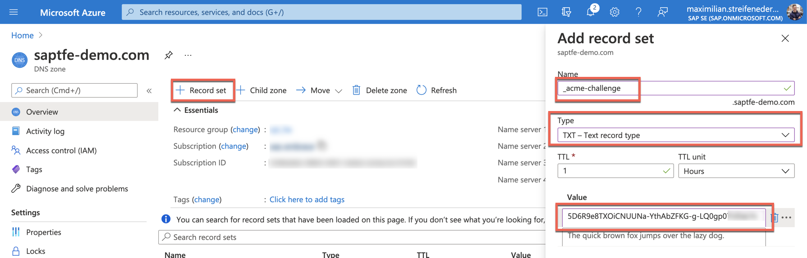

14. Hit **Enter** in the Terminal (where you have recently executed the certbot command in Step 11) to continue the verification process. 

    **Windows**

    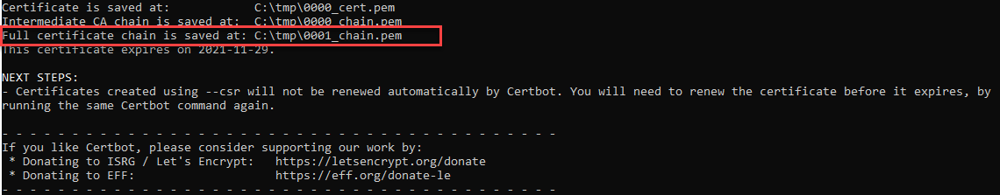

    **macOS**
    
    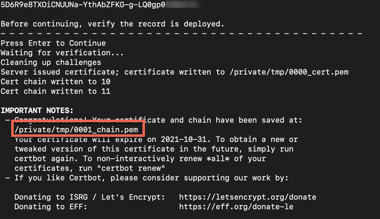

    > IMPORTANT: sometimes it could happen that you have to repeat the last steps a few times, depending on the output in the terminal. Please be aware there are rate limits on the letsencrypt side [click here](https://letsencrypt.org/de/docs/rate-limits/) so make sure you're not repeating the process too often.

15. Open the certificate chain that has been created in the previous step in a text editor of your choice. 

    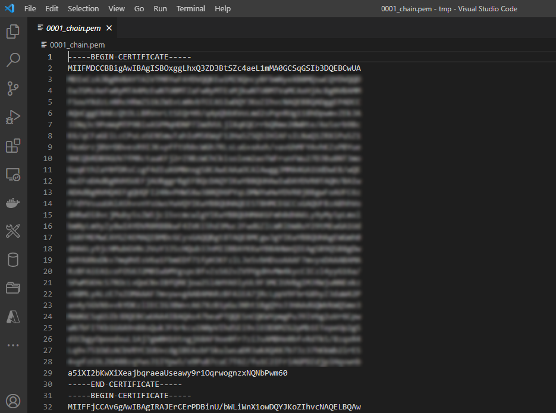

16. Open a new broswer tab, go to <https://letsencrypt.org/certs/isrgrootx1.pem>, download the certficate and copy the content of the entire ISRG Root X1 Certificate. 

    > Don't forget to copy the entire content including '-----BEGIN CERTIFICATE-----' and '-----END CERTIFICATE-----'
    
17. Paste the content of the ISRG Root X1 Certificate to the end of the created certificate chain on your local machine that you have opened during step 15. Save it as a new file, for instance **certificate1.pem**. 

    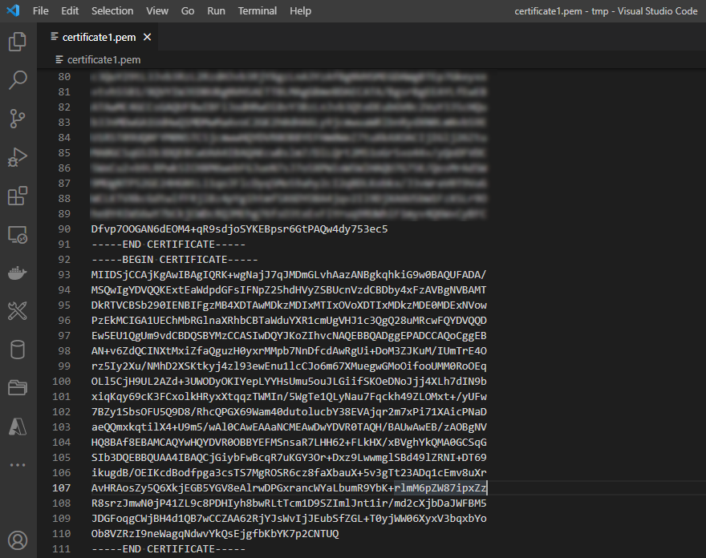

18. Upload and activate the certificate.

    ```console
    cf custom-domain-upload-certificate-chain keyazuretemp certificate1.pem
    ```

    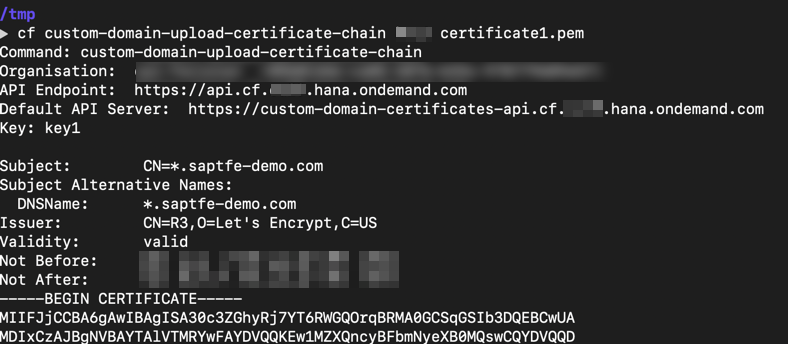

    > Note: *keyazuretemp* refers to the key you have created in Step 5, certificate.pem is the name of the file that you have created in the previous step.

19. Activate the custom domain.

    ```console
    cf custom-domain-activate keyazuretemp "*.example.com"
    ```

    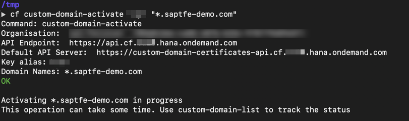


20. Verify the custom domain activation.

    ```console
    cf custom-domain-list
    ```

    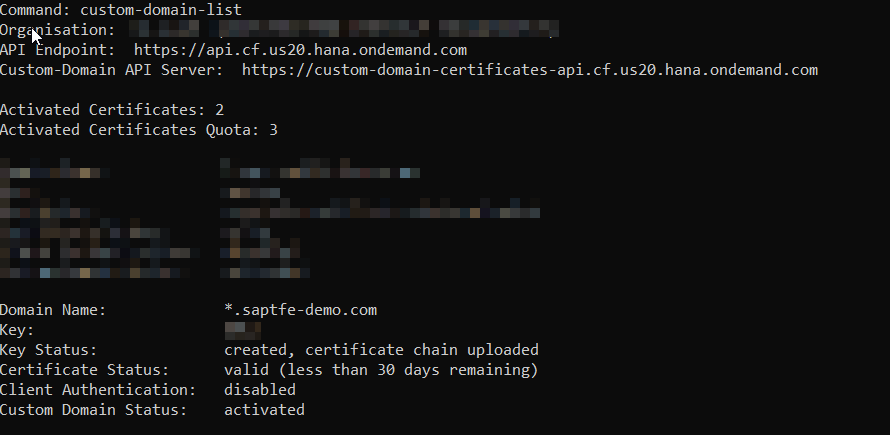

    > Note: It can take a few minutes up to a few hours until the custom domain is activated. 

## Map the Custom Domain to application

1. To make your application reachable from custom domain, add the routes ([reference](./cloud-cap-samples-java/mta.yaml)) in mta.yaml.
   
    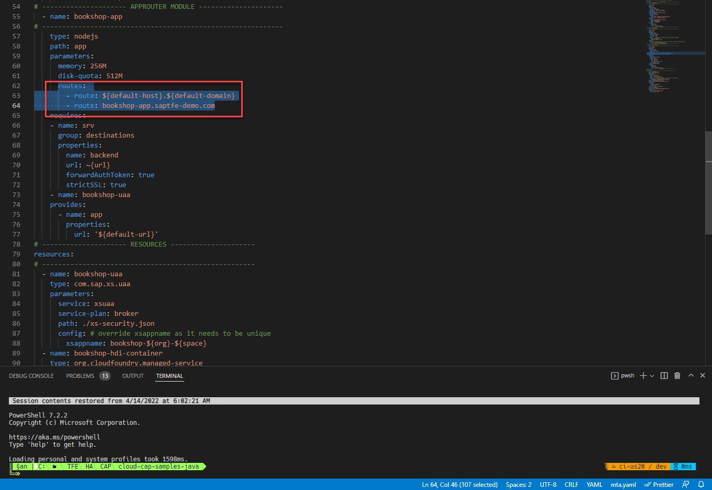
   
2. Also add the OAuth redirect configuration in xs-security.json ([reference](./cloud-cap-samples-java/xs-security.json)).
    ```
    "oauth2-configuration": {
        "redirect-uris": [
            "http*://*.saptfe-demo.com/**"
        ]
    }
    ```

3. Add the routes for actuator enpoint in app/xs-app.json ([reference](./cloud-cap-samples-java/xs-app.json)). This will be used in Azure Traffic Manager configuration.
     
     ```
     {
		"source": "^/actuator/(.*)$",
		"authenticationType": "none",
		"destination": "backend"
	  }
    ```

4. Modify the app/fiori.html to region specific as follows, so that easy to differentiate while testing.

    Here changing the *Browse Books* description from *Find your favorite book* to ``Loading from AP Region``.
    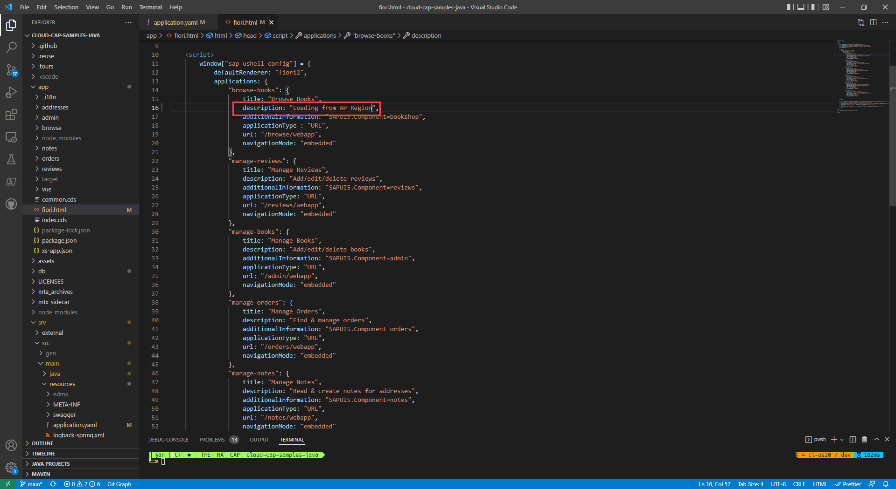

5. Build and deploy the application.

    ```
    mbt build
    cf deploy ./mta_archives/bookshop_1.0.0.mtar
    ```
   
    **Note** : Incase of Bad Gateway issue as follows, delete the bookshop-uaa Service and redeploy.

    ``` 
    "bookshop-uaa" failed: Bad Gateway: CF-ServiceBrokerBadResponse(10001) 
    ```

**Execute all of the steps for second subaccount!**

Congratulations! You have created a certificate for your domain using Certbot. With the help of the SAP Custom Domain Service you registered the domain in the subaccounts in which you also provisioned CAP applications and mapped its URL to the actual domain.

Keep in mind that the Let's Encrypt certificate (the one you have created using Certbot) is only valid for three months. There are other more sophisticated alternatives for productive scenarios.