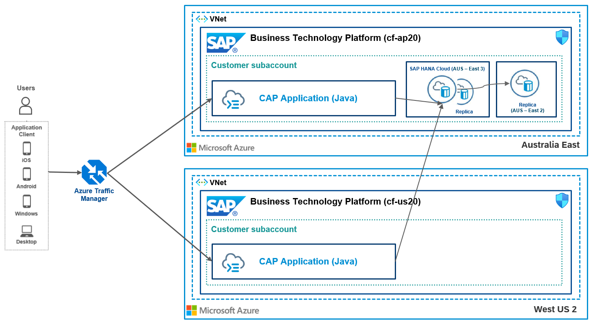

# Distributed Resiliency of CAP applications using SAP HANA Cloud (Multi-Zone Replication) with Azure Traffic Manager

This repository contains code samples and step-by-step instructions to enable *Distributed Resiliency of CAP applications using SAP HANA Cloud Multi-Zone Replication with Azure Traffic Manager*.

## Description

In this scenario, we are going to deploy CAP applications to multiple regions with an active-active setup. SAP HANA Cloud is configured with synchronous and asynchronous replicas on the availability zones (AZs) and Azure Traffic Manager is used for routing incoming requests to SAP BTP subaccounts across different regions based on the maintained configurations, which can performance-based, weighted or geo-based.

This reference architecture is for building modern applications and analytics solutions across the enterprise data with cloud-native scalability, speed, and performance. This will not address the data availability and latency use cases that require multi-region availability.

**Approximate RPO (Recovery Point Objective)**
| Traffic Routing | Presentation / Web tier | Application tier | Data tier                                      |
| --------------- | --------------------- | ----------------- | ---------------------------------------------- |
|Based on DNS Time-to-Live (TTL) of the Azure Traffic Manager profile plus an additional two minutes.  Minimum TTL config is possible with 1 second       | Based on the Routing      | Based on the Routing  | Recover from Backup takes less than 15 minutes. |

## Solution architecture
The conceptual solution diagram below shows a hybrid and multi-cloud architecture design, which integrates applications with cloud services and solutions on multiple cloud platforms.

This mission shows how to develop a resilient CAP application on SAP Business Technology Platform using SAP HANA Cloud Availability Zones (AZ) and Azure Traffic Manager.  

## Challenge
Failures in applications cannot be avoided. Therefore, the time between a failure and its correction, as well as the frequency of failures, must be reduced. 
- Automatic failover of CAP applications
- Reducing latency for CAP applications globally (e.g. US users accessing CAP applications in Australia)
- Load balancing between CAP application tenants (increasing throughput of your tenant beyond scale-up capabilities)
  
## Outcome

A cloud-native integration pattern that incorporates SAP BTP and Azure to eliminate downtime, reduce global latency and increase throughput. The approach can be applied to other SAP BTP services in the same way. Check the [Further Reading Section](./README.md#furtherreading) for other examples.

## Solution
- Configuring SAP HANA Cloud Availability Zones and Replicas
- Using your own domain for CAP applications using the SAP Custom Domain Service
- Configuring Azure Traffic Manager and different Azure Traffic Manager profiles to decouple connection information
  
## Requirements

The required systems and components are:

- SAP BTP PAYGO or CPEA agreement
- 2 SAP BTP subaccounts: e.g. one in AP20, one in US20
- A Microsoft Azure subscription
- An own domain

Entitlements/Quota required in your SAP Business Technology Platform account:

| Service                     | Plan             | Number of instances |
| --------------------------- | ---------------- | ------------------- |
| Custom Domain Service       | Custom Domain    | 2                   |
| SAP HANA Schemas & HDI Containers       | hdi-shared    | 1                   |
| SAP HANA Cloud      | hana    | 1                  |
| Authorization and Trust Management Service      | broker    | 2                   |

Subscriptions required in your SAP Business Technology Platform Account:

| Subscription               | Plan                                                   |
| -------------------------- | ------------------------------------------------------ |
| SAP Business Application Studio|  Standard (Application)                                |

## Table of Contents

[Step 1: Setup SAP HANA Cloud - Availability Zones and Replicas](./01-Setup%20SAP%20HANA%20Cloud%20HA/README.md)

[Step 2: Deploy CAP Java project to different regions](./02-Setup%20CAP%20Application/README.md)

[Step 3: Map Custom Domain Routes](./03-Map%20Custom%20Domain%20Routes/README.md)

[Step 4: Setup Azure Traffic Manager](./04-Setup%20Azure%20Traffic%20Manager/README.md)

[Step 5: Test Failover Scenario](./05-Test%20Failover%20Scenario/README.md)

[Step 6: Additional Findings and Analyses](./06-Additional%20Findings/README.md)

##  Further Reading

GitHub: [SAP BTP Cloud Integration Intelligent Routing](https://github.com/SAP-samples/btp-cloud-integration-intelligent-routing)

GitHub: [High Availability of SAP Launchpad service](https://github.tools.sap/btp-use-case-factory/launchpad-ha)

Blogpost: [Architecting Solutions on SAP BTP for High Availability](https://blogs.sap.com/2021/08/17/architecting-solutions-on-sap-btp-for-high-availability/) by [Murali Shanmugham](https://people.sap.com/muralidaran.shanmugham2)

## Known Issues
This scenario will not address any multi-region latency issue, since the SAP HANA Cloud instance is running within one hyperscaler region. The application will access the database across regions, which may lead to latency issues.

In SAP HANA Cloud, bi-directional multi-region replication is currently impossible, so we have to use the best possible solution of setting up two replicas (synchronous and asynchronous) in the same region.

## How to obtain support

[Create an issue](https://github.com/SAP-samples/cap-distributed-resiliency/issues) in this repository if you find a bug or have questions about the content.
 
For additional support, [ask a question in SAP Community](https://answers.sap.com/questions/ask.html).

## Contributing
If you wish to contribute code, offer fixes or improvements, please send a pull request. Due to legal reasons, contributors will be asked to accept a DCO when they create the first pull request to this project. This happens in an automated fashion during the submission process. SAP uses [the standard DCO text of the Linux Foundation](https://developercertificate.org/).

## License
Copyright (c) 2022 SAP SE or an SAP affiliate company. All rights reserved. This project is licensed under the Apache Software License, version 2.0 except as noted otherwise in the [LICENSE](LICENSES/Apache-2.0.txt) file.
