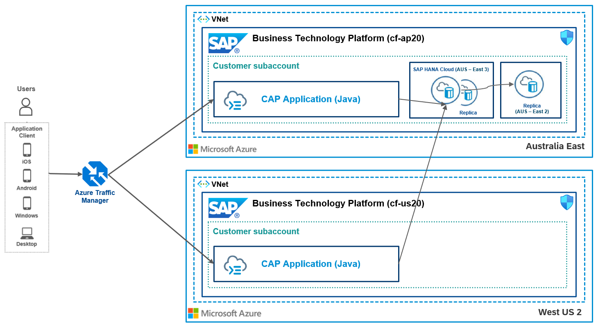

# Distributed Resiliency of SAP CAP applications using Amazon Aurora (Read Replica) with Amazon Route 53 

This repository contains code samples and step-by-step instructions to enable *Distributed Resiliency of CAP applications using Amazon Aurora with Amazon Route 53*.

## Introduction
Resilience, or resilient software design, is about handling failures that occur in complex system landscapes during runtime and ideally should not be noticed by the users. As opposed to traditional stability approaches, its goal is not to reduce the probability of failure occurrence, but to maximize the availability of systems and system landscapes. It accepts the unavoidability and unpredictability of failures and focuses on dealing with them as quickly as possible.

There are many different principles and patterns you can use to make your software resilient. It is, however, not always easy to find the combination that best fits your applications. The [Developing Resilient Apps on SAP BTP Guide](https://help.sap.com/viewer/eadaa45871804b4a974be865f627e791/Cloud/en-US/d1fe5fd8ecfb46c193221ebb991af3d7.html) gives an overview of the various options you have when developing applications and detailed information about the individual patterns you can use.

#### High Availability at Platform and Services

In the SAP Business Technology Platform, you can make use of the Availability Zones (AZ),  The Availability Zones (AZ) are single failure domains within a single geographical region and are separate physical locations with independent power, network, and cooling. Multiple AZs exist in one region and are connected through a low-latency network.

The SAP BTP services such as SAP Launchpad and SAP HANA Cloud are deployed across multiple Availability zones (AZ), which improves the availability of service if there are issues with the infrastructure of one AZ.

#### High Availability at Application Level

When developing applications, we have to consider different aspects of the applications to support resiliency. There are different tiers while developing CAP applications. 

The **Presentation/Web tier** is the user interface and communication layer of the application, where the end-user interacts with the application. This tier is typically developed using SAP UI5 or HTML5 technology. The SAP Launchpad service is used as a central entry point to these apps.  The high availability on this tier can be improved using Availability zones (AZ).

The **Application tier** is the heart of the application, where all the business logic is used to process the information from the presentation tier. This tier is often developed using different buildpacks provided by the SAP BTP Cloud Foundry environment.  It also utilizes different services offered by the SAP Business Technology Platform. Running multiple application instances to increase the availability on this tier.

The **Data tier** is located at the backend where the information provided is managed, stored, and retrieved when needed.  For high availability across multiple AWS Regions, you can set up Aurora global databases. Each Aurora global database spans multiple AWS Regions, enabling low latency global reads and disaster recovery from outages across an AWS Region.

## Distributed Resiliency
Most of the applications can achieve high levels of resiliency with a standard Availability zones (AZ) setup, but these might not work in case of natural disaster, which usually on across regions or it can be a case of SAP BTP service upgrade across regions, where there will be an outage for few hours. 

In such cases, it is recommended to run your application in active-active (Distributed Resiliency) across regions. This also helps to achieve different other objectives such as  
-   Low latency for globally distributed audience
-   Always-on availability for complete regional outages
-   Best utilization of platform resources in multiple data centers.

This mission discusses the fundamental design patterns and sample implementations to build distributed resilient applications on the SAP Business Technology Platform (BTP) to meet the mission-critical application requirements.

## Solution Architecture
The conceptual solution diagram below shows a hybrid and multi-cloud architecture design, which integrates applications with SAP BTP services and solutions on multiple cloud platforms.

In this scenario, we are going to deploy the CAP applications to multiple regions with active-active setup. The Amazon Aurora Global Data Base Cluster is configured with cross-region read replica. Amazon Route 53 is used for routing the request to different region subaccounts based on the maintained configurations.

## Challenge
Failures in applications cannot be avoided. Therefore, the time between a failure and its correction, as well as the frequency of failures, must be reduced. 
- Automatic Failover for CAP applications
- Reducing Latency for CAP applications Globally (e.g. US users accessing CAP applications in Australia in a failover scenario)
- Load balancing between CAP application tenants (increasing throughput of your tenant beyond scale-up capabilities)

## Outcome

A cloud native integration pattern that incorporates SAP BTP and AWS cloud platform to eliminate downtime, reduce global latency and increase throughput. The approach can be applied to other BTP services in same way. Check the [Further Reading Section](./README.md#furtherreading) for other examples.

## Solution
- Configuring Amazon Aurora Global Database 
- Using your own domain for SAP CAP Application using the SAP Custom Domain Service
- Configuring Amazon Route 53 and different Amazon Route 53 profiles to decouple connection information
  
## Requirements

The required systems and components are:

- SAP BTP enterprise account
- 2 SAP BTP subaccounts: e.g. one in AP10, another in US10
- AWS cloud platform subscription
- An own domain

Entitlements/Quota required in your SAP Business Technology Platform Account:

| Service                     | Plan             | Number of instances |
| --------------------------- | ---------------- | ------------------- |
| Custom Domain Service       | Custom Domain    | 2                   |
| Authorization and Trust Management Service      | broker    | 2                   |
| HTML5 Application Repository      | app-host    | 2                   |
| Cloud Foundry runtime     |     | 2                   |
| Application Logging      | lite    | 2                   |

Subscriptions required in your SAP Business Technology Platform Account:

| Subscription               | Plan                                                   |
| -------------------------- | ------------------------------------------------------ |
| SAP Business Application Studio|  Standard (Application)                                |

## Setup and Configuration

#### [Step 1: Setup Amazon Aurora Global Database](./01-Setup%20AWS%20Aurora/README.md)

#### [Step 2: Deploy the SAP CAP Java project to different regions](./02-Setup%20CAP%20Application/README.md)

#### [Step 3: Map Custom Domain Routes](./03-Configuring%20Custom%20Domains/README.md)

#### [Step 4: Setup Amazon Route 53](./04-Setup%20Route53/README.md)

#### [Step 5: Test Failover Scenario](./05-Test%20Failover%20Scenario/README.md)

#### [Step 6: Access and Discover Application Logs and Metrics](./06-Logging/README.md)

#### [Step 7: Setup of Continuous Integration and Continuous Delivery (CI/CD)](./07-CICD/README.md)

#### [Step 8: Setup of SAP Cloud Transport Management to keep tenants in sync](./08-TMS/README.md)

#### [Step 9: Setup of Alert Notification](./09-ANS/README.md)

#### [Miscellaneous: Additional Findings and Analyses](./10-Additional%20Findings/README.md)

##  Further Reading

GitHub: [BTP Cloud Integration Intelligent Routing](https://github.com/SAP-samples/btp-cloud-integration-intelligent-routing)

GitHub: [High Availability of SAP Launchpad service](https://github.tools.sap/btp-use-case-factory/launchpad-ha)

Blogpost: [Architecting Solutions on SAP BTP for High Availability](https://blogs.sap.com/2021/08/17/architecting-solutions-on-sap-btp-for-high-availability/) by [Murali Shanmugham](https://people.sap.com/muralidaran.shanmugham2)

## Known Issues
This scenario will not address the multi-region latency issue, since the application will access the DB from across regions, which may lead to latency issues.

## How to obtain support
[Create an issue](https://github.com/SAP-samples/cap-distributed-resiliency/issues) in this repository if you find a bug or have questions about the content.
 
For additional support, [ask a question in SAP Community](https://answers.sap.com/questions/ask.html).
## Code of Conduct
Refer to [CODE OF CONDUCT](CODE_OF_CONDUCT.md) file.

## Contributing
If you wish to contribute code, offer fixes or improvements, please send a pull request. Due to legal reasons, contributors will be asked to accept a DCO when they create the first pull request to this project. This happens in an automated fashion during the submission process. SAP uses [the standard DCO text of the Linux Foundation](https://developercertificate.org/).

## License
Copyright (c) 2022 SAP SE or an SAP affiliate company. All rights reserved. This project is licensed under the Apache Software License, version 2.0 except as noted otherwise in the [LICENSE](LICENSE) file..
