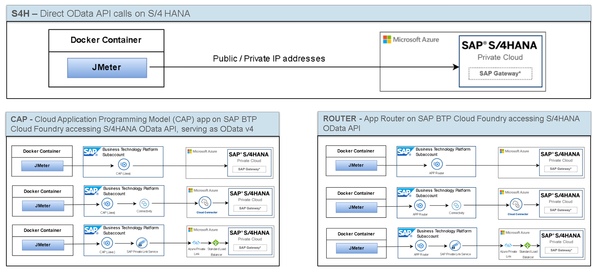

# Multi-region Distributed Performance Testing
[](https://codespaces.new/SAP-samples/cap-distributed-resiliency/tree/Performance-Landscape)

## Introduction
If you want to run or migrate your SAP based applications in (to) the cloud you have many options and many decisions to take. Besides regulatory, data sovereignity and cost reasons, performance requirements are the main parameters to consider. Having a more detailed look there is often the question where to place SAP BTP sub accounts as this decision can be impacted by the BTP service availability on a specific hyperscaler in a specific region. Sometimes the nearest possible BTP subaccount with the desired BTP service would be on a different hyperscaler than your SAP S/4 HANA system or another SAP LOB application like SAP SucccessFactors HCM. Different from working with Infrastructure-as-a-Service resources on hyperscalers like Alibaba Cloud, Amazon Web Services, Google Cloud or Microsoft Azure where you are in full control of the Software-Defined-Network (SDN) you rarely get in contact with the low level networking setup when using the SAP BTP Platform-as-a-Service (PaaS).

### Purpose of the Document
The purpose of the "Multi-Region Distributed Performance Testing" is to provide a structured and comprehensive record of the entire process and outcomes of multi-region distributed performance testing. 
### Scope and Objectives of Multi-Region Testing
The scope of this testing involves specifying the regions, components, network conditions, user scenarios, testing environments, and types of testing to be included. The objectives encompass evaluating performance, scalability, resilience, user experience, bottleneck identification, compliance, load balancing, capacity planning, and providing recommendations for optimization. 

### Target Audience
The document is intended for a wide range of stakeholders, including development teams, QA teams, project managers, system architects, IT teams, management, business stakeholders, and compliance authorities, among others.

## Test Planning

### Overview of the Application
A "Manage Sales Order Fiori Application" is a user-friendly, modern software application designed to streamline the process of creating, tracking, and managing sales orders within a business environment, adhering to Fiori design principles

We are employing the OData service within this application to evaluate performance across various scenarios, which encompass:

-   Ping test between different locations and comparison with available data from Microsoft
   - OData requests from different user locations using different proxy and connection options on BTP (direct client to SAP S/4HANA, proxy via SAP API Management, proxy via App Router) connection options were (public IP, private IP where applicable, SAP Cloud Connector and SAP PrivateLink where applicable)
   - CAP CF Java App accessing Odata Service on SAP S/4HANA and serving as OData endpoint



- Direct OData API calls on S/4 HANA
- App Router on SAP BTP Cloud Foundry accessing S/4HANA OData API
- Cloud Application Programming Model (CAP) app on SAP BTP Cloud Foundry accessing S/4HANA OData API, serving as OData v4
- Access using SAP Build Workzone. 

### Geographic Regions Included in Testing
The testing effort encompasses a wide array of geographic regions. Here are the regions under consideration for this purpose.

#### Asia Pacific region
| Name             | Region Description         |
|------------------|----------------------------|
| KoreaCentral     | Central region of Korea    |
| JapanEast        | Eastern region of Japan    |
| JapanWest        | Western region of Japan    |
| EastAsia         | Eastern Asia               |
| SoutheastAsia    | Southeastern Asia           |

#### Europe region
| Name                | Region Description           |
|---------------------|------------------------------|
| WestEurope          | Western Europe               |
| NorthEurope         | Northern Europe              |
| SwedenCentral       | Central region of Sweden     |
| UKSouth             | Southern United Kingdom      |
| GermanyWestCentral  | West Central Germany         |


#### North America region
| Name             | Region Description          |
|------------------|-----------------------------|
| CanadaCentral    | Central region of Canada    |
| CanadaEast       | Eastern region of Canada    |
| EastUS2          | Eastern United States 2     |
| SouthCentralUS   | South Central United States |
| WestUS2          | Western United States 2    |

### Performance Benchmarks
These benchmarks help in evaluating speed, efficiency, and resource utilization. 

- A single OData service should complete in under 150 milliseconds to provide better user experience. 
- Initial load of the Fiori application with multiple OData service should complete within 1.5 seconds. 

## Environment Setup


JMeter operates within Docker containers, offering enhanced portability and scalability for performance testing. In a distributed testing setup, the JMeter controller takes charge of test design, execution control, and result aggregation. Simultaneously, worker nodes execute load generation and data collection tasks, enabling comprehensive performance analysis across varying user load scenarios.

The test results are pushed to an Influx database and showcased on a Grafana dashboard, all of which are accommodated within a SAP BTP, Kyma runtime environment.

### JMeter Environment Setup
The complete JMeter environment, including worker and controller nodes are containerized to facilitate straightforward deployment across diverse environments. In this specific case, we have chosen Azure Container Instances to host both the worker and controller nodes. Additionally, this repository includes Terraform scripts for seamless deployment.

We will initiate the setup of Azure Container Instances (ACI) with one controller and multiple worker nodes, aligning with the geographic region requirements.

1. Click on [](https://codespaces.new/SAP-samples/cap-distributed-resiliency/tree/Performance-Landscape) and create your code spaces. This contains the required cli tools.  
2. Terraform provides a range of [authentication methods for Azure](https://registry.terraform.io/providers/hashicorp/azurerm/latest/docs/guides/service_principal_client_certificate), and our choice is to use Azure CLI for authentication.

3. Please run the following commands in order to set up the JMeter Container instances. Adjust the commands if you are using a different authentication method. Make sure you have a "tfvars" file configured according to your geographic region requirements. You can use the sample "terraform_ap.tfvars" as a template for creating your own environment. 
``` 
    cd terraform/azure
    # Login with device code
    az login --use-device-code
    # Set the Subscription ID (Refer the link to get the subscription ID https://learn.microsoft.com/en-us/azure/azure-portal/get-subscription-tenant-id)
    az account set --subscription <Subscription ID>
    Example: 
    az account set --subscription 53990dba-8128-4100-bb6d-aed38861c9f8
    
    terraform init

    # If you are planning to create multiple landscapes, set the Terraform workspace to distinguish between environments.
    terraform workspace new ap
    terraform workspace select ap
   
   
    terraform plan -var-file=<.tfvars file>
    Example:
    terraform plan -var-file="terraform_ap.tfvars"
    
    terraform apply -auto-approve -var-file=<.tfvars file> 
    Example:
    terraform apply -auto-approve -var-file=terraform_ap.tfvars
```

Upon the successful execution of Terraform script, you will receive a list of worker IP addresses as shown below. Modify the configuration branch with the worker node region and IP address details as needed.
   

To confirm the landscape's status, execute the ```az container list``` command. Once the testing environment is prepared, it's time to commence the testing phase.


```
# Login to the controller Azure Container instance
az container exec --exec-command "/bin/bash" --resource-group <resource-group> --name <ACI container instance name for the controller>
Example:
az container exec --exec-command "/bin/bash" --resource-group btp-perftest-with-SAP --name perftest-westeurope-controller

#There are different ways to start the test. Let us try with manual execution
./run.sh -b <config branch> -r <repo url> -c <config .json>

Example:
./run.sh -b Performance-Config -r https://<Personal Access Token>@github.com/SAP-samples/cap-distributed-resiliency.git -c config-ap/daily/GlobalTestConfig.json

# This will trigger the tests on different worker nodes based on the configurations available in config branch.
```
If you wish to schedule executions at various times, modify the SchedulerConfig file within the config branch and then restart the ACI container for the controller.

   
   
### Dashboard Setup
Execute the following commands to set up the Dashboard Environment in Kyma runtime
        
```
    curl --create-dirs -o /root/.kube/config <KubeconfigURL>
    example
    curl --create-dirs -o /root/.kube/config https://kyma-env-broker.cp.kyma.cloud.sap/kubeconfig/7F1225F4-69D7-4072-A36E-632311FA19

    cd terraform/kyma
    terraform init
    terraform plan
    terraform apply
```
### Performance Metrics Collected
  

- `Average`	 Average value (might be biased from outliers and ramp up calls)
- `Median`	Median value (50% percentile – much less impact from outliers)
- `90/95/99th Percentile`	The nth percentile is the smallest score that is greater than or equal to a certain percentage of the scores. To rephrase this, it’s the percentage of data that falls at or below a certain observation

  

## Conclusion
### Summary of the Multi-Region Distributed Performance Testing
  - The response times did not exceed critical 150ms for all test constellations tested in Europe (OData standard request with result set of 10 sales orders)    
   - SAP BTP subaccount and SAP S/4HANA should be placed geographically close to each other (dependent on use case)
   - Cross hyperscaler traffic e.g. SAP S/4HANA on Azure to SAP BTP on AWS did not have any negative performance impact (response time and throughput)
   - We could not find a significant performance difference between SAP Cloud Connector and Private Link traffic  
   - Canada test results are comparable to Europe results, using BTP location on AWS (Montreal CA10) with SAP S/4HANA in Canada Central (Toronto) provides slightly better performance than using Azure Region East US (Ashburn, VA US21)
   - Azure will try by default to keep traffic on Azure network if both orgin and target are on a Azure even when using public IPs (aka "cold potato routing")

## How to obtain support
[Create an issue](https://github.com/SAP-samples/cap-distributed-resiliency/issues) in this repository if you find a bug or have questions about the content.
 
For additional support, [ask a question in SAP Community](https://answers.sap.com/questions/ask.html).
## Code of Conduct
Refer to [CODE OF CONDUCT](CODE_OF_CONDUCT.md) file.

## Contributing
If you wish to contribute code, offer fixes or improvements, please send a pull request. Due to legal reasons, contributors will be asked to accept a DCO when they create the first pull request to this project. This happens in an automated fashion during the submission process. SAP uses [the standard DCO text of the Linux Foundation](https://developercertificate.org/).

## License
Copyright (c) 2022 SAP SE or an SAP affiliate company. All rights reserved. This project is licensed under the Apache Software License, version 2.0 except as noted otherwise in the [LICENSE](LICENSE) file..