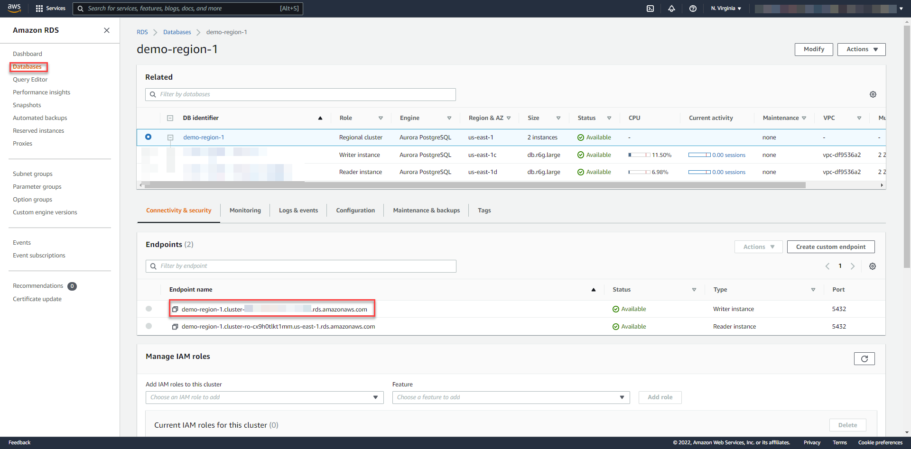

# Setup CAP Java project to different regions of SAP Business Technology Platform

### You will learn
 - How to design a resilent CAP application architecture for Amazon Aurora Global Database
 - How to deply the bookshop sample application to different regions of the SAP Business Technology Platform


> ### Prerequisites
> - Make sure you have set up a development environment (that means, you’ve set up SAP Business Application Studio for Development) [as described here](https://developers.sap.com/tutorials/appstudio-onboarding.html).
> - Go to your [SAP BTP Cockpit](https://cockpit.eu10.hana.ondemand.com/) and make sure that you have two subaccounts in your global account. In this case, we have both of them on Azure - one in Asia Pacific (AP10), one in US (US10). If you don't have them yet, click on `New Subaccount` in order to create a new subaccount.

>
>   NOTE: If you already have two subaccounts in different regions, you don't necessarily need to create separate accounts for this tutorial. You can simply reuse the existing ones, if you want. These regions can be from same or different hyperscalers.

## Clone and Test
Clone an existing CAP application in SAP Business Application Studio and deploy it to SAP BTP, Cloud Foundry Runtime.

1. Go to https://github.com/SAP-samples/cloud-cap-samples-java.git and fork the repository. So that you have a dedicated fork on github.com. In one of the subsequent steps you can connect your fork with the SAP Continuous Integration and Delivery service to run certain pipelines.

2. Choose your user as destination for the fork. 

    You should now have the repository: github.com/Your User/cloud-cap-samples-java.git.

3.  In SAP Business Application Studio, click on view and find command, then search and select for git clone.
   

4. Specify the previously forked git repository and select the location as Projects. 
    
    Repo: https://github.com/Your User/cloud-cap-samples-java.git

    

5. Build and run the application in SAP SAP Business Application Studio using following command. 
    ```
    mvn spring-boot:run
    ```
   

6. Click `Open in a New Tab` to open the differernt cds-services and UI endpoints.
   
    

7. Then click on `Fiori UI` and use the following mock users for testing 
    - User: `user`, password: `user` to browse books
    - User: `admin`, password: `admin` to manage books and orders

## Deploy to SAP Business Technology Platform
The sample bookshop application comes with two predefined profiles: default and cloud  (see srv/src/main/resources/application.yaml). The default profile specifies to use an in-memory H2 database and deploying the application to Cloud Foundry, the CF Java Buildpack automatically configures the cloud Spring profile. We will modify the cloud Spring profile to work with *Amazon Aurora PostgreSQL-Compatible Edition*

The PostgreSQL support is not natively available in CAP framework, so we need to follow different process for the deployment.

6. Use the SAP Business Application Studio Terminal and login to the subaccount.
   
    ```
    cf login -a https://api.cf.ap20.hana.ondemand.com
    ```
**Deploying DB Models:**

7.  We are going to use two Open Source Node.js modules (cds-pg, cds-dbm) in combination with @sap/cds for deployment.
Add the database details to project descriptor file (package.json). [Reference](./cloud-cap-samples-java/package.json)
    ```
    "dependencies": {
        "cds-dbm": "^0.0.36",
        "cds-pg": "0.0.51",
        "express": "^4"
    },
    "cds": {
        "requires": {
        "db": {
            "kind": "database"
        },
        "database": {
            "impl": "cds-pg",
            "model": [
            "srv"
            ],
            "credentials": {
            "host": "<Aurora cluster writer endpoint>",
            "port": 5432,
            "database": "bookshop",
            "user": "postgres",
            "password": "<DB Password>"
            }
        }
        },
        "migrations": {
            "db": {
                "schema": {
                "default": "public",
                "clone": "_cdsdbm_clone",
                "reference": "_cdsdbm_ref"
                },
                "deploy": {
                "tmpFile": "tmp/_autodeploy.json",
                "undeployFile": "db/undeploy.json"
                }
            }
        }
    }
    ```

8. We need to deploy the corresponding db artifacts to the PostgreSQL database. As mentioned above, cds deploy cannot be leveraged. Instead, we need to make use of the cds-dbm tasks. Refer [documentation](https://github.com/mikezaschka/cds-dbm#commands).
   
    To deploy the changes, simply call the following cmd from the terminal (npx is required as of now).
    ```
    npx cds-dbm deploy
    ```
    The following cmd helps to load the sample data, which is in db\data folder.  
    ```
    npx cds-dbm load --via full
    ```

    **Note:** We have to remove few csv files from db\data location, otherwise  sample data load throws an exception with duplication
    
    **Files to remove:**

    

**Deploying Router and Backend Modules:** 

9. Add the PostgreSQL dependency in srv\pom.xml([reference] (./cloud-cap-samples-java/pom.xml)) 
````
<dependency>
    <groupId>org.postgresql</groupId>
    <artifactId>postgresql</artifactId>
    <version>42.3.3</version>
</dependency>
````

10. Rename the mta-single-tenant.yaml to mta.yaml.  
10. Remove the bookshop-hdi-container references and bookshop-db module from mta.yaml ([reference](./cloud-cap-samples-java/mta.yaml)) and modify the build-parameters.
   
    

   
11.  Also modify the application.yaml file ([reference](./cloud-cap-samples-java/application.yaml)) for Amazon Aurora PostgreSQL-Compatible Edition data source. Copy the Amazon Aurora PostgreSQL-Compatible Edition Endpoint URL from Amazon RDS Management console and configure the cloud profile.
    
    


12. To make use of Amazon Aurora PostgreSQL fast failover, your application's connection string should have a list of hosts instead of just a single host. 
Copy the Amazon Aurora PostgreSQL Endpoint URLs from different regions and configure profile ([reference](./cloud-cap-samples-java/application-faf.yaml))

    ```
    jdbc:postgresql://<demo-region-1 endpoint>:5432,
    <demo-region-2 endpoint>:5432
    /bookshop?currentSchema=public&loginTimeout=2
    &connectTimeout=2&cancelSignalTimeout=2&socketTimeout=60
    &tcpKeepAlive=true&targetServerType=primary
    ```
    **Note:** 
    - targetServerType - allows opening connections to only servers with required state/role in accordance to the defining factor for the PostgreSQL servers. The allowed values are any, primary, secondary, preferSlave, and preferSecondary.  State or role is determined by observing if the server allows writes or not.
      
    - These configurations can be easily configured via application.yaml file. But sometimes you need more flexibility to change the configuration without redeploying. Check the [Externalize Data source configuration](./README.md#externalize) 

13. Right click on mta.yaml file and Build the application.
    

14.  Deploy the mtar to SAP Business Technology Platform subaccount.
    
 
15. Repeat the step 14 for other subaccounts.
    
> Refer the [CI/CD pipeline](../../../Operational%20Resiliency/CICD/README.md) that automatically builds, tests, and deploys your code changes. Also refer [Cloud Transport Management Service](../../../Operational%20Resiliency/TMS/README.md) for propagate it towards different regions.

Congratulations! Now you have a sample bookshop application running on subaccounts of different regions and connecting to Amazon Aurora PostgreSQL-Compatible Edition. In the next tutorial, learn about mapping custom domain routes for this application.


## Appendix 
### <a name="externalize"></a> Externalize Data source configuration

The Spring configuration gives a lot of flexibility on how to configure different parts of the framework. When it comes to data source configuration, the same is true. However, some of the configuration options are better choice depending on the situation. For example, having a database connection string (URI) in the application.yaml files as spring.datasource.url is fine during the development or in the staging environment. On the other hand, a production database connection string hardcoded and committed to the source control won’t be considered OK in many situations. A very convenient way and at the same time supported by most of the cloud providers is setting secrets and configuration options as environment variables.  

1. Modify the application.yaml something like follows to read from environment variable. 

    ```yaml
    spring:
    config.activate.on-profile: cloud
    datasource:
        driver-class-name: org.postgresql.Driver
        url: ${datasource_url}      
        username: ${datasource_username} 
        password: ${datasource_password} 
        initialization-mode: never
        hikari:
            maximum-pool-size: 10
    ```
2. After deploying the application, add the following environment variables 
   -    Open SAP BTP Cockpit and navigate to bookshop-srv application
   -    Choose User-Provided Variables from the navigation pane, and add the following variables
          ``` 
          datasource_url: <db url> 
          datasource_username: <db user>
          datasource_password: <db password>
          ```
           
       
       
    - After adding, restart the application to ensure that variable changes take effect.
