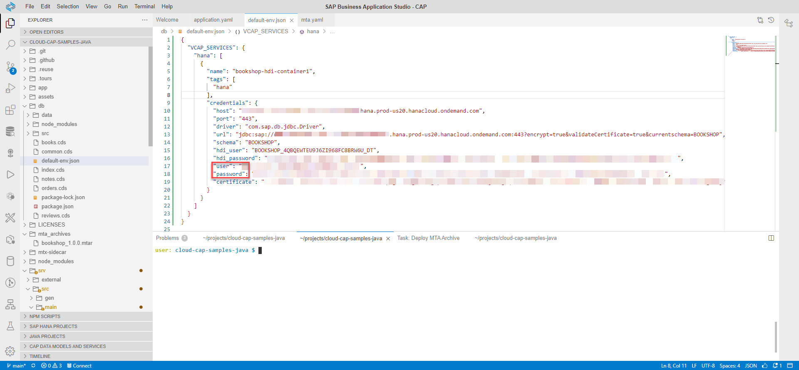

# Setup CAP Java project to different regions of SAP Business Technology Platform

### You will learn
 - How to design resilent CAP application architecture with SAP HANA Cloud as the persistency layer
 - How to deploy the bookshop sample application to different regions of SAP Business Technology Platform


> ### Prerequisites
> - Make sure you have set up a development environment (that means, you’ve followed the instructions outlined on "Set Up SAP Business Application Studio for development") [as described here](https://developers.sap.com/tutorials/appstudio-onboarding.html).
> - Go to your SAP BTP Cockpit and make sure that you have two subaccounts in your global account. In this case, we have both of them on Azure - one in Asia Pacific (Australia (Sydney), AP20), one in West US (WA, US20). If you don't have them yet, click on New Subaccount in order to create a new subaccount.
> 
>     
>
>   NOTE: If you already have two subaccounts in different regions, you don't necessarily need to create separate accounts for this tutorial. You can simply reuse the existing ones, if you want. These regions can be from same or different hyperscalers

## Clone and Test
Clone an existing CAP application in SAP Business Application Studio and deploy it to SAP BTP, Cloud Foundry Runtime.

1. Go to https://github.com/SAP-samples/cloud-cap-samples-java.git and fork the repository. So that you have a dedicated fork on github.com. In one of the subsequent steps you can connect your fork with the SAP Continuous Integration and Delivery service to run certain pipelines.

2. Choose your user as destination for the fork. 

    You should now have the repository: github.com/Your User/cloud-cap-samples-java.git.

3.  In SAP Business Application Studio, click on view and find command, then search and select for git clone.
   

4. Specify the previously forked git repository and select the location as Projects. 
    
    Repo: https://github.com/Your User/cloud-cap-samples-java.git

    

5. Build and run the application in SAP SAP Business Application Studio using following command. 
    ```
    mvn spring-boot:run
    ```
   

6. Click `Open in a New Tab` to open the differernt cds-services and UI endpoints.
   
    

7. Then click on `Fiori UI` and use the following mock users for testing.
    - User: `user`, password: `user` to browse books
    - User: `admin`, password: `admin` to manage books and orders

## Deploy to SAP Business Technology Platform
The sample bookshop application comes with two predefined profiles: default and cloud  (see srv/src/main/resources/application.yaml).

The default profile specifies to use an in-memory H2 database and deploying the application to Cloud Foundry runtime, the CF Java Buildpack automatically configures the cloud Spring profile. This profile doesn’t specify any data source location. In that case CAP Java can automatically detect SAP HANA Cloud service bindings available in the environment.

We need to follow a different process and modify few files for deployment since we have a SAP HANA Cloud instance running in one subaccount (West US, US20) but we need to deploy the application to different subaccounts (Australia, AP20 and West US, US20)

**Deploying Models**

1. Use the SAP Business Application Studio Terminal and login to the subaccount, where SAP HANA Cloud instance is running. In my case, SAP HANA Cloud instance is running in West US, US20.
   
    ```
    cf login -a https://api.cf.us20.hana.ondemand.com
    ```

2. Manually create a HDI container on your tenant database by running the following command and provide the necessary parameters in JSON format:
    ``` 
    cf create-service hana SERVICE_PLAN SERVICE_INSTANCE -c {"database_id" : "<tenant-db-instance-guid>", "schema": "<schema name>"}
    
    Example: 
    cf create-service hana hdi-shared bookshop-hdi-container -c '{"schema": "bookshop"}'    
    ```

    **Note**: Here I am specifying the schema name as *bookshop* to make it user friendly. If you have more than one SAP HANA Cloud instance in your account, you can also pass the *database_id* to choose the instance.

3. Deploy the models using cds deploy.
   ```
   cds deploy --to hana:bookshop-hdi-container
   ```

**Deploying Application**

4. Rename the mta-single-tenant.yaml to mta.yaml.

5. Remove the bookshop-hdi-container references and bookshop-db module from mta.yaml file ([reference](./cloud-cap-samples-java/mta.yaml)). 
   
6. We need to modify the application.yaml file ([reference](./cloud-cap-samples-java/application.yaml) for SAP HANA Cloud data source. This requires SAP HANA Cloud instance end point url and user details. These are available in db/default-env.json (Note: This file was generated in step 3).

   Copy the following details from default-env.json and use it in application.yaml. 
    

   Modify the spring cloud profile with SAP HANA Cloud instance details, which is copied from previous step.
    
    
7. Now all the changes are complete. Let us build and deploy the application. To build, right-click on mta.yaml file and select Build the application. This will create the *mtar* file under *mta_archives*.
    

    else use the following terminal command to build
    ```
     mbt build
    ```

8. Now we have the compiled mtar file, which can be deployed to different regions of SAP Business Technology Platform subaccount. Let us right-click on the mtar file and select Deploy MTA Archive for deployment.
    
    

    else use the following terminal command to deploy

    ```
    cf deploy mta_archives/bookshop_1.0.0.mtar
    ```
    **Changing the subaccount**: SAP Business Application Studio offers two ways to connect to subaccounts
    
    - UI-based, from the [Command Palette](https://help.sap.com/docs/SAP%20Business%20Application%20Studio/9d1db9835307451daa8c930fbd9ab264)
     
      

    - CLI-based, from the [Terminal](https://help.sap.com/docs/SAP%20Business%20Application%20Studio/9d1db9835307451daa8c930fbd9ab264)
        
      

9. Repeat the step 8 for other SAP BTP subaccounts. 

 > Refer the [CI/CD pipeline](../../../Operational%20Resiliency/CICD/README.md) that automatically builds, tests, and deploys your code changes. Also refer [Cloud Transport Management Service](../../../Operational%20Resiliency/TMS/README.md) for propagate it towards different regions.

Congratulations! Now you have a sample bookshop application running in subaccounts of different regions and connecting to SAP HANA Cloud instance with synchronous and asynchronous replication. In the next tutorial, learn about mapping custom domain routes for this application.
