# Azure Traffic Manager setup

### You will learn
- How to configure Azure Traffic Manager
- How to configure different Azure Traffic Manager profiles
- How to configure a CAP application to use Azure Traffic Manager intelligent routing

> ### Prerequisites
> - Make sure you have the Azure Traffic Manager enabled. 

## Setup Azure Traffic Manager profile
In this step, you will configure Azure Traffic Manager (actually the Azure Traffic Manager profile). The Azure Traffic Manager profile is the key component in this *intelligent routing* scenario, as it defines which CAP application should be used when, based on certain rules and policies. 

1. Go to the [Azure Portal](http://portal.azure.com) and log in. 

2. Search for **Traffic Manager profile** and select the corresponding item.

    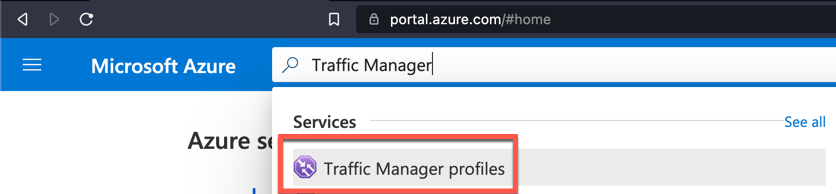

3. We need to **Create** 2 new Azure Traffic Manager profiles, since we have an approuter and server module.  

    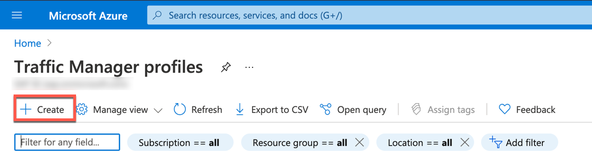

4.  Provide a meaningful name (e.g. *cap-failover*) for the Azure Traffic Manager profile, select **Priority** as the routing method and assign it to one of your subscriptions. If necessary, create a new Resource Group. 

    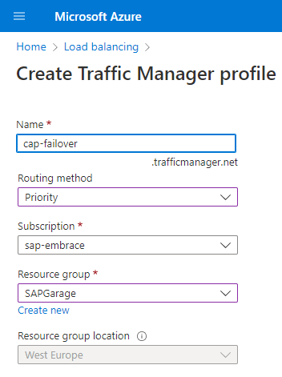

5. Continue with **Create**. 

6. Wait until the deployment was succesfully finished. Select **Go to resource** to navigate to the details of the profile.

    > Alternatively you can also refresh the list of all Azure Traffic Manager profiles and select the recently created Traffic Manager profile.

    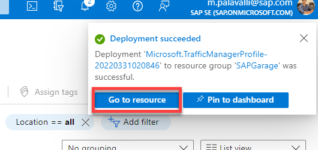

7. Select **Configuration** in the navigation area. 

    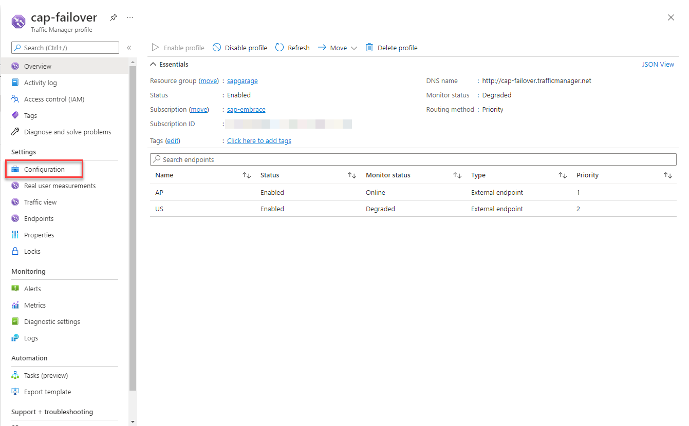

8. Provide the following settings: 

    - Routing method: Priority
    - DNS time to live (TTL): 1
    - Protocol HTTPS
    - Port: 443
    - Path: /actuator/health
    - Expected Status Code Range: 200-200
    - Probing interval: 10
    - Tolerated number of failures: 1
    - Probe timeout: 5

    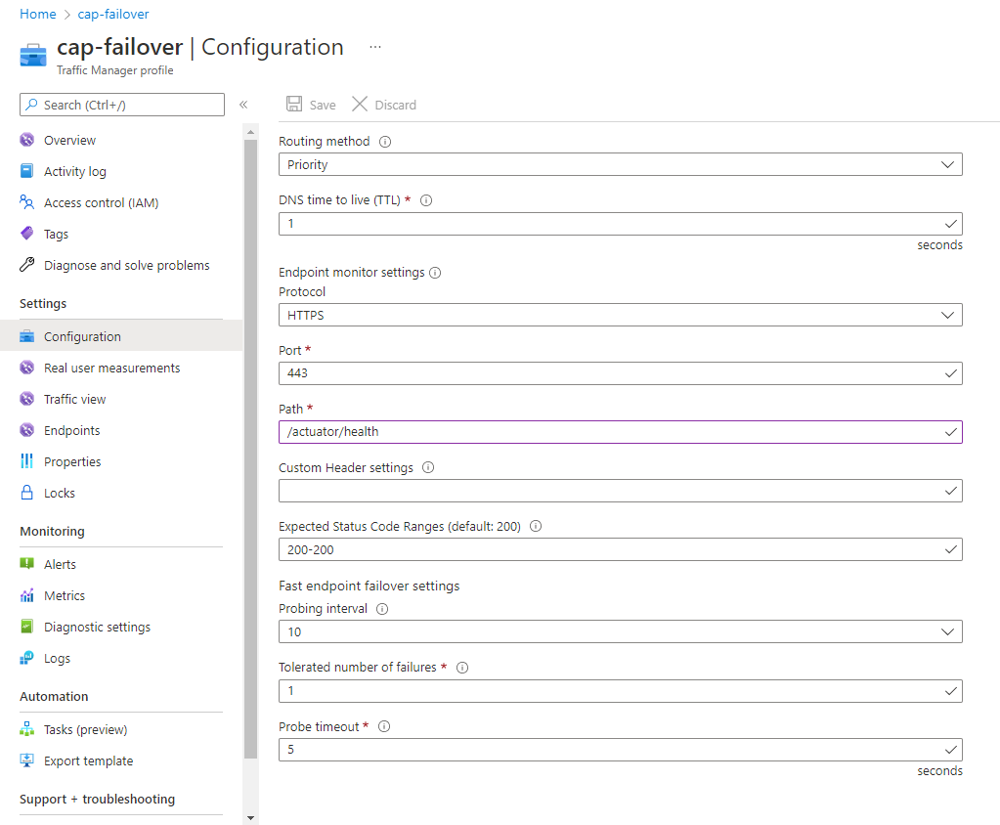

    > **IMPORTANT**: Those settings enable the fatest failover that's possible based on DNS time to live & the **fast endpoint failover settings**. The more often the **monitor** endpoint (/actuator/health) the higher the amount of messages your CAP app needs to handle. How often the monitor endpoint is called is defined by the combination of probe timeout and probing interval. Adjust the settings for your productive scenario depending on your needs. 

    > **Note**: The path you have defined is later on used to monitor every defined endpoint in the Azure Traffic Manager profile. The exact path is then concatenated with the endpoints target that we'll define in one of the subsequent steps.

9. Continue with **Save**.

10. Select **Endpoints** in the navigation area. 

11. **Add** a new endpoint and set the following parameters:

    - Type: External endpoint
    - Name: US
    - Fully-qualified domain name (FQDN) or IP: CAP application URL for US subaccount (without any path)
    - Priority: 1

    > Note: Fetch the CAP application routing URL using terminal command
    ``cf app bookshop-app``

    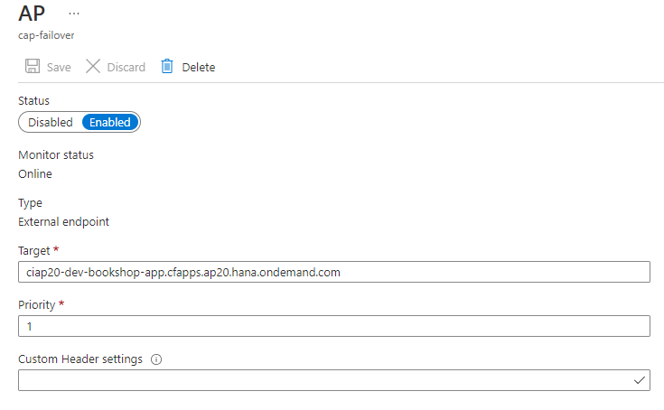

12. You have created the first endpoint in the Azure Traffic Manager profile. **IMPORTANT: Repeat the Step 11 for the other CAP application in the other SAP BTP region(s).**

13. Display **Overview** of your Azure Traffic Manager profile and copy the **DNS Name**. 

    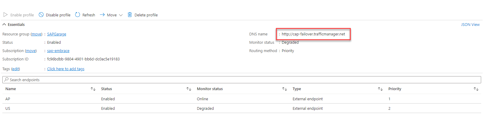

14. Go to to the **DNS Zone** of your domain. 

    
    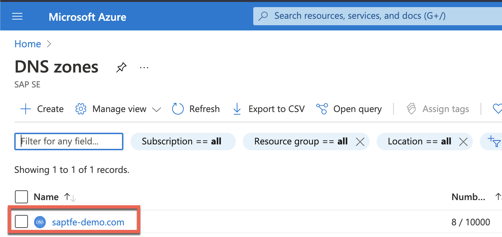

15. Create a record set for the subdomain that [you have mapped to the CAP application URL](../03-MapCustomDomainRoutes/README.md#endpointmapping): 

    - Name: subdomain that you have mapped to the CAP application URL
    - Type: CNAME
    - Alias Record Set: No
    - TTL: 1 Second (depending on your requirements, how fast a failover should be executed)
    - Alias: DNS Name of the Azure Traffic Manager profile that you have copied in Step 18 - without *http://*(e.g. http://cap-failover.trafficmanager.net)

    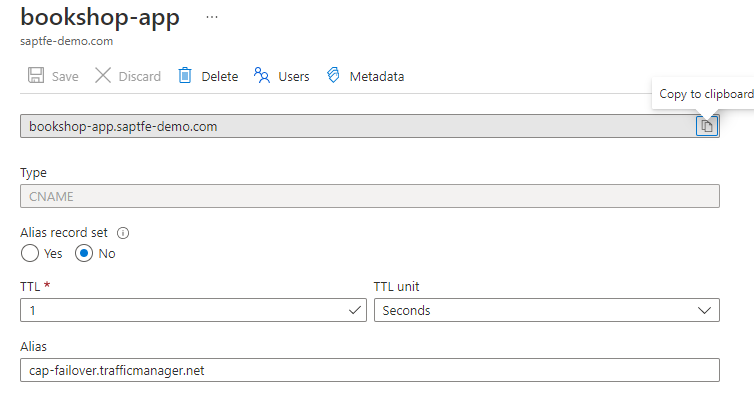

16. You can now access the CAP application url using the custom domain.
    
    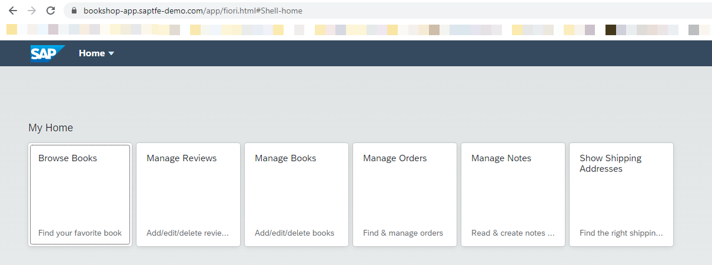

  
Congratulations. You have created an Azure Traffic Manager profile that detects which tenant should handle the user requests based on a monitoring endpoint deployed. All the requests sent to the mapped route in Cloud Foundry are going to the Azure Traffic Manager profile because of the CNAME record set in the DNS Zone of the domain. Azure Traffic Manager then decides on the priority setting which tenant should handle the request. All of this happens on DNS level. (If you want to use the Azure Traffic Manager for other scenarios like loadbalancing, reducing latency or others - have a look at the [available routing methods](https://docs.microsoft.com/en-us/azure/traffic-manager/traffic-manager-routing-methods).)

