# Amazon Route 53 Traffic flow setup

### You will learn
- How to configure Amazon Route 53 Traffic flow
- How to configure different Amazon Route 53 Traffic flows
- How to configure a CAP application to use Amazon Route 53 Traffic flow for intelligent routing

> ### Prerequisites
> - Make sure you have the AWS cloud platform subscription. 


## Setup Amazon Route 53 Traffic flow
1. Go to the [AWS Console](https://console.aws.amazon.com/) and log in. 

2. Search for **Route 53** and select the corresponding item and select Traffic Management.

    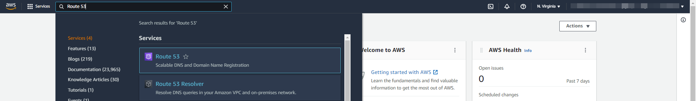

    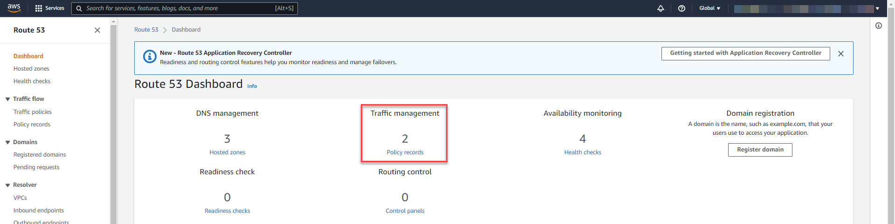

3. We need a health check monitoring for our application to Configure the DNS failover. Let us create Amazon Route 53 health check monitor for our application. In the navigation pane, choose *Health Checks* then choose *Create Health Check*. ([more details](https://docs.aws.amazon.com/Route53/latest/DeveloperGuide/health-checks-creating-deleting.html))
   
    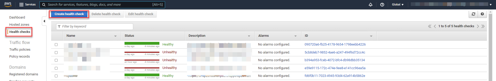

4. Specify the Monitoring endpoint and save. This is our application actuator health endpoint.
   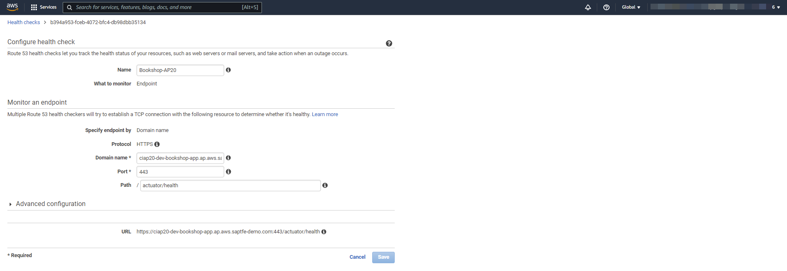

5. Once health monitoring endpoints are created, will move to traffic policy creation. In the navigation pane, choose *Traffic Policies* then choose *Create Traffic Policy*.

    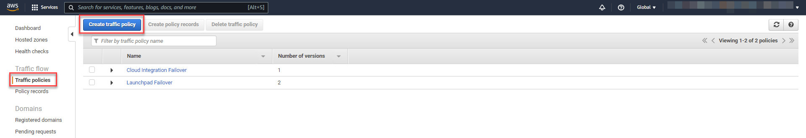

6.  Provide a meaningful name (e.g., *CAP Failover*) and click next.
   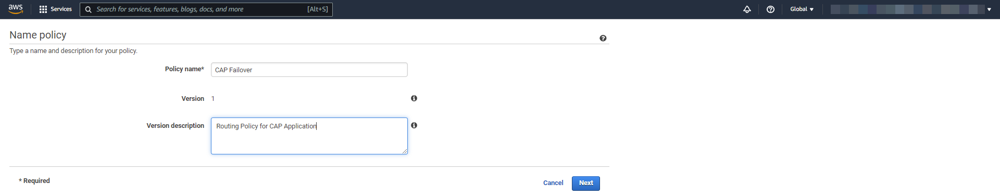

7. The console displays the graphical traffic policy editor. 
   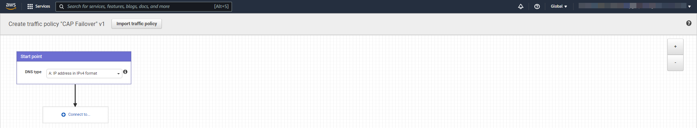

8. Creater a Failover Rule and end point configurations. Get the application endpoints using terminal command and configure the Failover rules.
   
    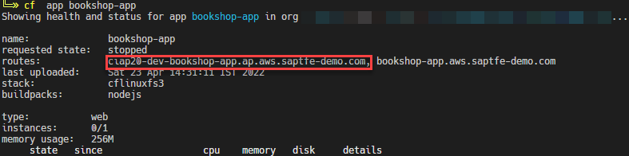

    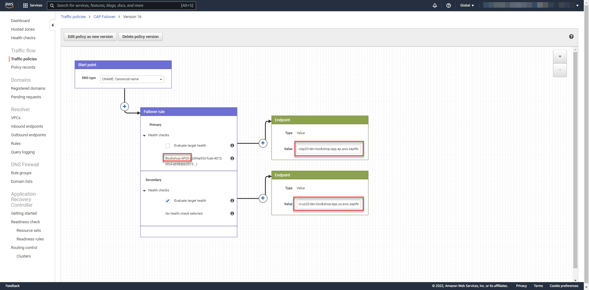

9. Continue with **Create Traffic Policy**.
   
10.  Then Create policy records with traffic policy created before. (Select the Hosted Zone and  end DNS Name) 
    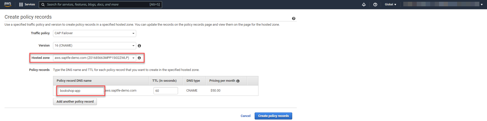

11. Continue with **Create Policy Records**. After completion, traffic policy and  policy records looks something like follows. 
    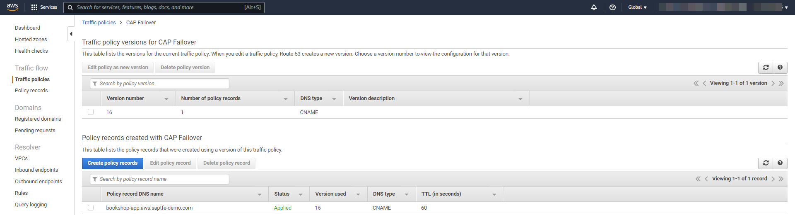

12. If we access the application using policy record throws an error as *404 Not Found: Requested route ('bookshop-app.aws.saptfe-demo.com') does not exist.*.  This is because of no route mapping configured in our application based on the Policy Record created in Step 10. 
This can be done at the time of deployment or else create manually as using terminal command. 
    ```
    cf map-route <APP_NAME> <DOMAIN> --hostname <HOSTNAME>
    Example:
    cf map-route bookshop-app aws.saptfe-demo.com --hostname bookshop-app
    ```
    **Note**: Execute the same in other region subaccount also. 

13.  You can now access the CAP Application url using Route 53 Traffic Management Policy Records.
     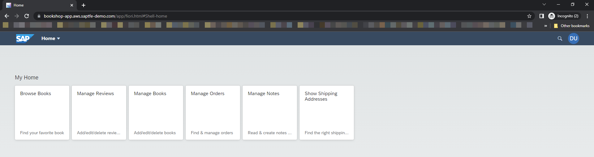

  
Congratulations. You have created a Route 53 Traffic Management that detects which tenant should handle the user requests based on a monitoring endpoint deployed. All the requests sent to the mapped route in Cloud Foundry are going to the Route 53 Traffic Management because of the CNAME record set in the DNS Zone of the domain. Route 53 Traffic Management then decides on the priority setting which tenant should handle the request. All of this happens on DNS level. (If you want to use the Route 53 Traffic Management for other scenarios like loadbalancing, reducing latency or others - have a look at the [available routing methods](https://docs.aws.amazon.com/Route53/latest/DeveloperGuide/traffic-flow.html).)

