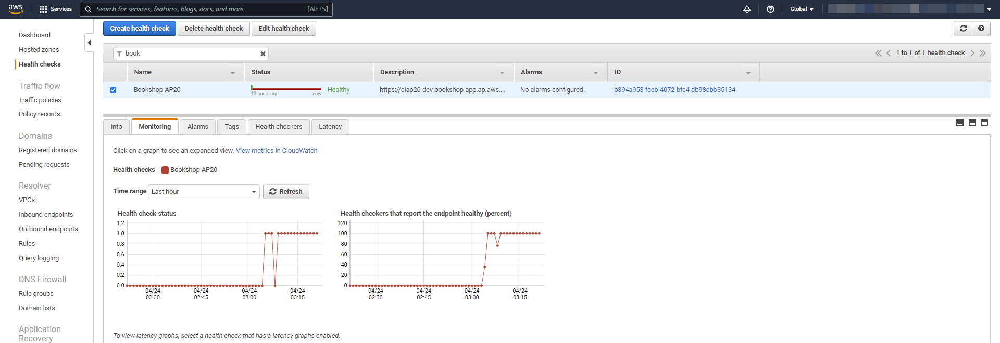
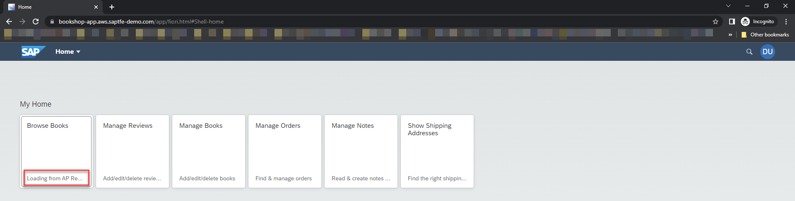
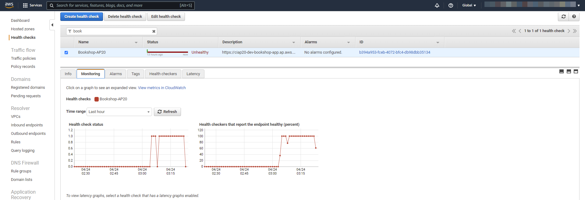
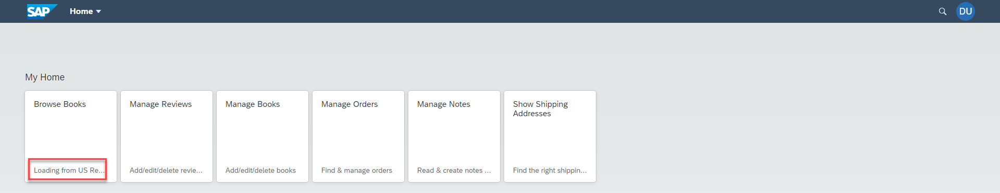
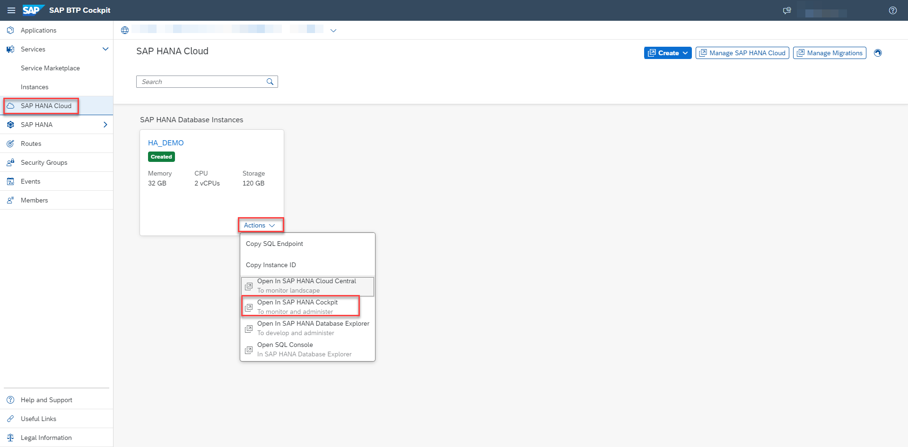
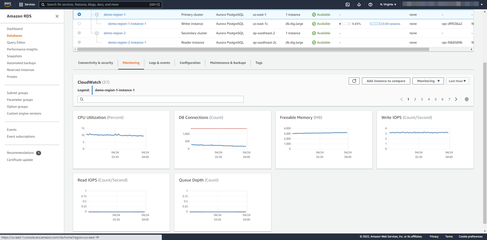
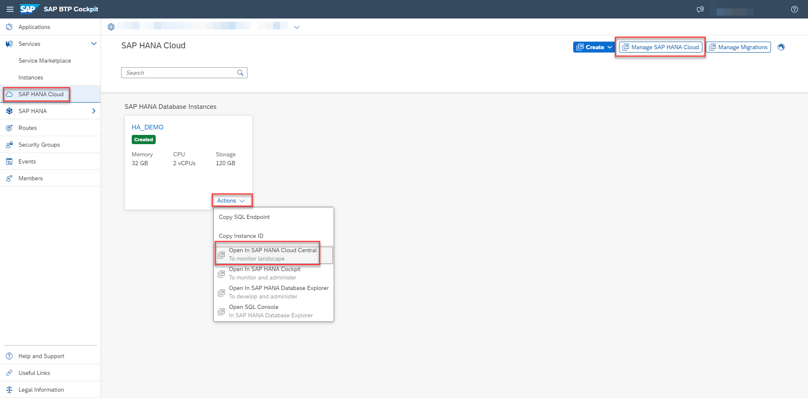
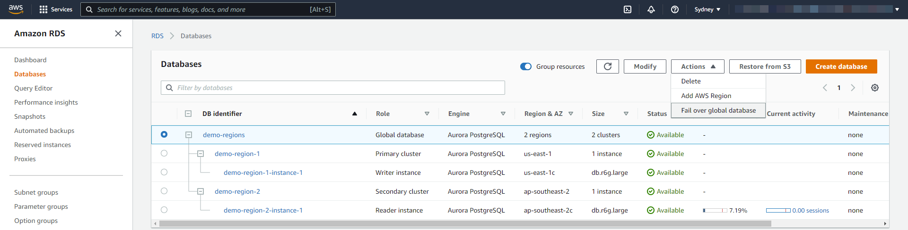

# Testing the application

### You will learn
- Testing CAP application for intelligent routing
- Testing SAP HANA Cloud Availability Zones and Replicas

> ### Prerequisites
> - Make sure all the previous steps are completed and application end points are working.

## Failover in application layer
In the initial situation, CAP applications are online in both the regions and your primary region (priority 1 in Azure Traffic Manager) will process the requests. Then you simulate a situation where the primary regions is not available by stopping the application in primary region. Thus, Azure Traffic Manager will no longer receive the expected response from the call (HTTP 200) and will consider the primary region as offline.

Depending on the Failover & DNS TTL settings in Azure Traffic Manager profile, the secondary region (Priority 2 in Azure Traffic Manager) will process your upcoming requests after a certain time. The sender is effectively unaware of the process in the background, as it sends the requests to a domain regardless of the reachable regions in the background.

**Failover in application router module** 

1. Go to the Azure Portal and look at the Azure Traffic Manager profile. You should see that both regions are considered as online.


    Also you can see, the primary region handles the request based on the Azure Traffic Manager Profile configuration.

    

    
2. Let's now simulate that the primary region app is not available anymore. For testing purpose, you can stop the application using Terminal.
    ```
    cf stop bookshop-app
    ```

3. Check the status of the endpoints in the Azure Traffic Manager profile. Depending on your failover settings in the Azure Traffic Manager profile configuration it takes a few moments until the primary region is considered as Degraded.


4. Go back to your browser and refresh the page. 
   
   
   
   As you can see, the secondary region handles the request, since Azure Traffic Manager considers the primary region as not reachable.

**Failover in application backend module** 

  Let's now simulate the same scenario like before for backend Module (bookshop-srv module).

  1.  Start the router module, since we stopped in previous test. Also check the Azure Traffic Manager profile, both regions are considered as online.
        ```
        cf start bookshop-app
        ```  

  2. Let's now simulate that the primary region Backend Module is not available anymore. For testing purpose, you can stop the application using Terminal
        ```
        cf stop bookshop-srv
        ```  

  3. We could see the same result as before. In Azure Traffic Manager profile, primary region is considered as Degraded and refreshing the browser handles the request from secondary region.


## Failover in database layer

In our example, we have created a source and synchronous replica in one of the Availability Zone(wesus2-1) and asynchronous replicas to different zone (wesus2-2). With these, we have set up a Highly Available (HA) and a Disaster Recovery (DR) architecture. 

**Failover in High Availability architecture**:
If a technical issue happens within your main SAP HANA Cloud instance, a takeover is automatically triggered to the replica within the same Availability Zone. The latency is extremely minimal and takeover time is measured in seconds. We cannot manually replicate this scenario for testing. 

**Failover in Disaster Recovery architecture**: 
With multi-zone replication, all persistent data is also replicated to another availability zone. If a disaster happens at the data center where your SAP HANA Cloud database is located, you will be able to manually trigger a takeover to your Disaster recovery instance with minimal down-time and data loss.

> The `Start Takeover` menu option is only available if you have a replica enabled for your instance and the replica is located in a different availability zone. 
    
1.  Let us start by checking if the system replication is working properly. To do that, go to your Cloud Foundry space in the SAP BTP cockpit.
2.  In the navigation area, choose SAP HANA Cloud.
3.  Choose Actions and select Open In SAP HANA Cockpit. It enables you to perform administration and monitoring tasks at the database level, and administer and monitor all SAP HANA databases in SAP HANA Cloud.
    
4. Login to SAP HANA Cockpit as DBADMIN and verify the synchronization status by executing the system view *M_SERVICE_REPLICATION* in SQL console. This will show the statistics for asynchronous replication across Availability Zones. The fields SHIPPED_LOG_POSITION and SHIPPED_LOG_POSITION_TIME provide the latest state of the replica.
    

5.  Let us simulate the takeover, assuming  primary SAP HANA Cloud instance is having an issue and triggring the manual takeover. To do that, go to your Cloud Foundry space in the SAP BTP cockpit.
6.  In the navigation area, choose SAP HANA Cloud.
8.  Choose Manage SAP HANA Cloud. Alternatively, choose Actions and select Open In SAP HANA Cloud Central. 

    > SAP HANA Cloud Central enables you to administer and monitor SAP HANA Cloud instances

2. Trigger the manual takeover from the Actions menu, choose Start Takeover and select the preferred Availability Zone. This will take some time. You can monitor takeover performance and system availability in SAP HANA Cloud Central. The view M_SYSTEM_REPLICATION_TAKEOVER_HISTORY can also be used to monitor the progress of a takeover.
  
   
   > **Note:** When the takeover is started, transactions currently being executed are aborted by this action and other update transactions may be rolled back. Connected clients are paused until the takeover is complete
   
3. After takeover, application works as before without any change.   

Great job! You have configured the resilient CAP application using SAP HANA Cloud Multi-Zone Replication with Traffic Manager.