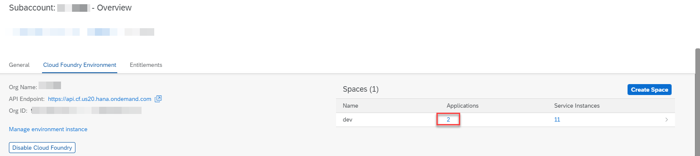
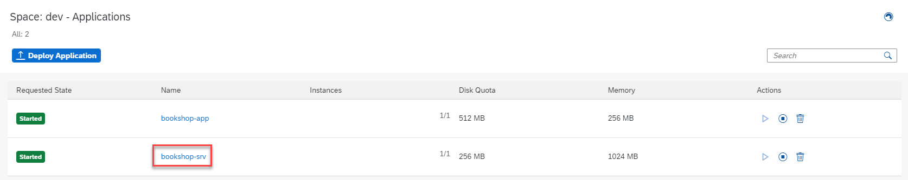
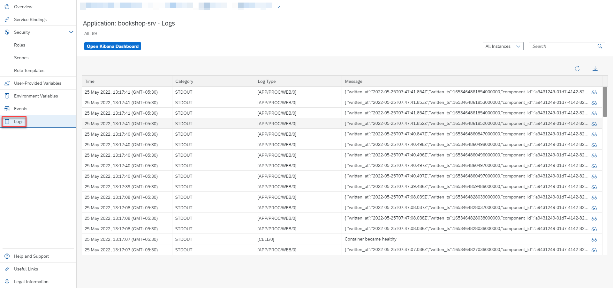
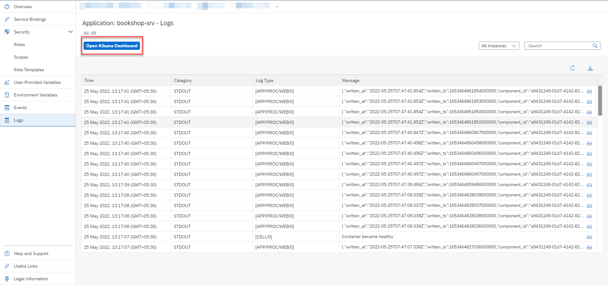
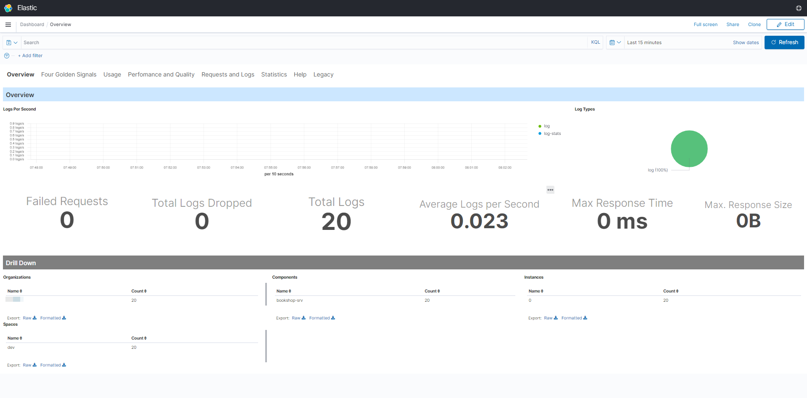
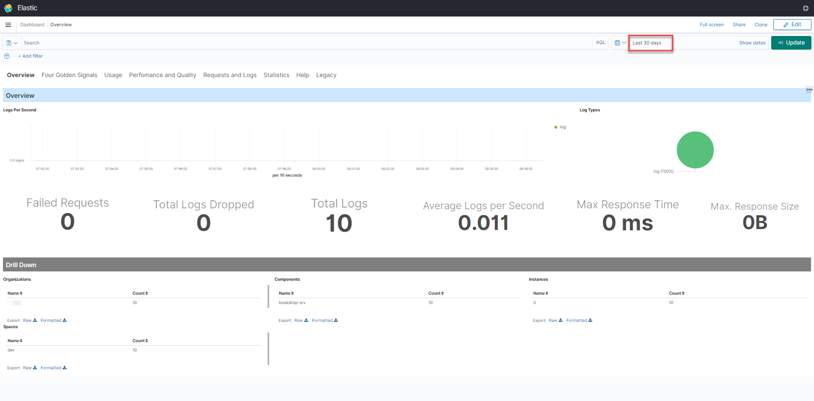
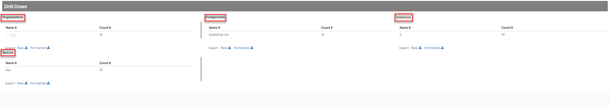
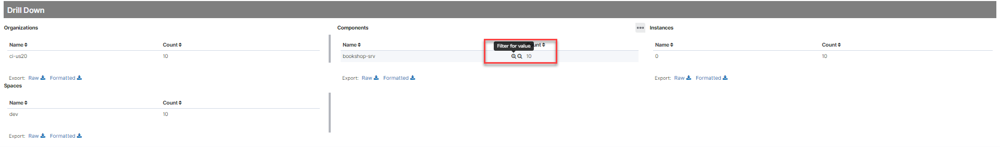
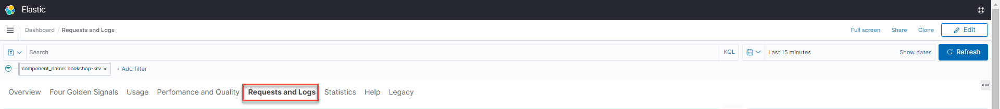
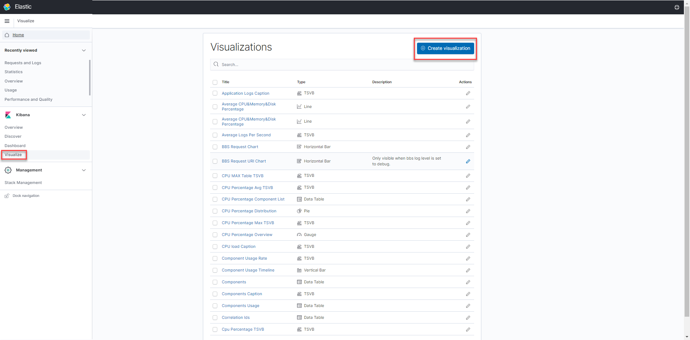

# Logging Service for Your Application

### You will learn
- How to access logs from command line window and SAP BTP cockpit
- How to analyze logs using Kibana dashboard
- How to enable Logging Service for your CAP application 

> ### Prerequisites
> - In our experience, the development plan wasn’t sufficient for test scenarios. Probably, its okay for personal development spaces. However, this tutorial uses the standard plan to be on the safe side.


## Enable Logging Service
The application logs are only kept for a short period of time and won’t be visible in Kibana without the Logging Service. By binding the Logging Service to your application, logs will be kept for longer and will be available for further analysis via Kibana.

1. Add the logging service instance to the resources section of your mta.yaml.
   ```yaml
      - name: cf-logging
         type: org.cloudfoundry.managed-service
         parameters:
            service: application-logs
            service-plan: lite
   ```

2. Bind the logging service instance to different modules of the mta.yaml.
   ```yaml
      modules:
      # --------------------- SERVER MODULE ------------------------
         - name: bookshop-srv
      # ------------------------------------------------------------
         ...
         requires:
            ...
            - name: cf-logging
   ```


3. Build and deploy it to your Cloud Foundry space:
   ```bash
         mbt build
         cf deploy bookshop_1.0.0.mtar
      ```

## Access logs from command line window

1.  Displaying the recent logs
      ```bash
        cf logs --recent <appname>
        Example:
        cf logs --recent bookshop-srv
      ```
2. Live logs.
      ```bash
        cf logs <appname>
        Example:
        cf logs bookshop-srv
      ```
3. Choose Ctrl + C to quit.

## Access logs from SAP BTP cockpit
1. Go the the SAP BTP Cockpit and navigate to the subaccount where the application is running in.
  
2. Click on the number of apps of the Cloud Foundry space your application is running in. 
   

3. Click on the **bookshop-srv** app. 
   

4. Open the **Logs** page. This page contains the recent logs.
   


## Analyze logs using Kibana dashboard

1. Click on **Open Kibana Dashboard**. 
 

2. Enter your SAP BTP credentials. 

3. You should now be able to see the default overview with some predefined dashboards. In some cases you won't see any data displayed because of the automatically selected time range. 
   

4. Change the time selection to **Last 30 days**. The dashboard rendering should update immediately and display some of your application KPIs. 
   > make sure you hit refresh or adjust the time selection whenever you don't see any data displayed.
    

5.  In the lower half of the page you do see a **Drill Down** of all Cloud Foundry organizations, spaces, components and app instances you have access with your SAP BTP user. 
      > This pages do not only display and visualize the logs of the application you used to navigate here. It contains all the logs of the entire region (for instance US20) but only of those subaccounts you are assigned to. 
       

6. Hover the line of **bookshop-srv** in the **Components** section. Then click on the icon to **Filter for value**. 
    
   As a result of that, you'll only receive data for the application **bookshop-srv** wherever you navigate in Kibana until you remove the filter again. 
    

7.  Use the navigation section in the upper part of the page to navigate to different predefined dashboards that visualize more data in detail. For instance, use the **Requests and Logs** link to get some more insights about Requests and Application Logs. 
      > Make yourself familiar with the navigation section and what insights you get out of the box. 
       

12. You can also access different predefined visualizations or create new visualizations using the icon in the sidebar. 
    
You can also create more complex queries using the [Kibana Query Language](https://www.elastic.co/guide/en/kibana/7.4/kuery-query.html).

Congratulations! Now you have enabled the Logging Service for your Application and Analyze the logs using Kibana dashboard.