# Setup CI/CD Pipeline

### You will learn
- How to enable SAP Continuous Integration and Delivery (CI/CD)
- How to configure a CI/CD pipeline
- How to run the CI/CD pipeline that automatically builds, tests, and deploys your code changes

> ### Prerequisites
> - You have developed a CAP application and prepared for deployment. 
> - GitHub repository for your project
> - Continuous Integration & Delivery subscription

## Enable SAP Continuous Integration and Delivery service
       
>Note, you can skip this step, if you used previously the Booster to initiate the Subaccount

   1. Go to your subaccount in SAP BTP
   2. Navigate to the Service Marketplace
   3. Find the Continuous Integration & Delivery Service and subscribe to the Service.
        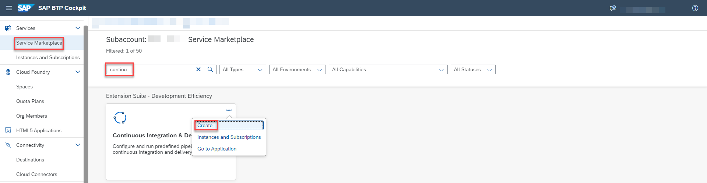
 
   4. Find your user and choose Assign Role Collection
        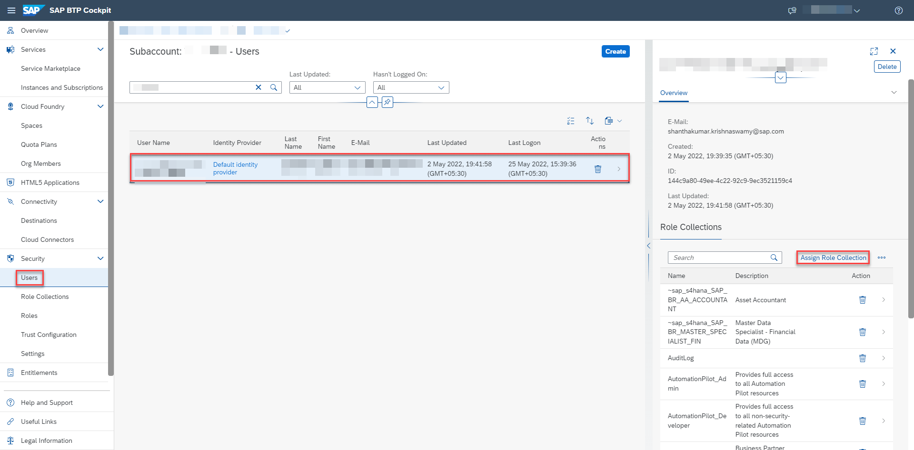
   5.  Assign the Role Collection **"CICD Administrator"** to your user
    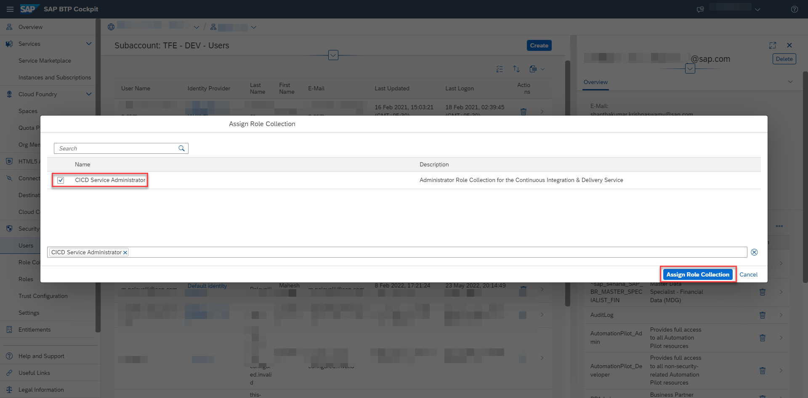

## Access Continuous Integration and Delivery service
  1.   In your SAP BTP subaccount, navigate to Services → Instances and Subscriptions in the left-hand pane
  2.   Choose the Go to Application icon located next to the Continuous Integration & Delivery subscription.
      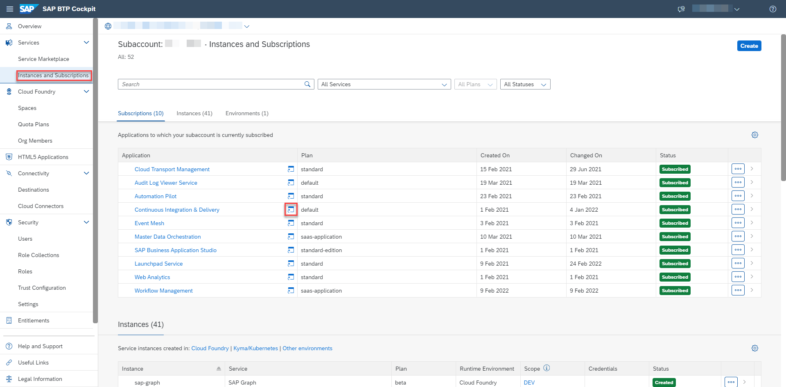
  3. Use your credentials to log in to the application.

## Configure your GitHub credentials
This section is relevant, if your GitHub repository is private.  Use the details from the repository, wheich we forked previously.  

Navigate to the Credentials tab in SAP Continuous Integration and Delivery and Choose ( + ) to create credentials.

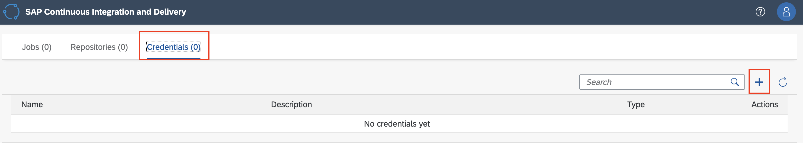

- For Name, enter a freely chosen name for your credential, which is unique in your SAP BTP subaccount.
- As type select *Basic Authentication* 
- For Username and password, GitHub username.and   personal access token.

    (Hint: access tokens can be created in GitHub by going to *Settings* -> *Developer Settings*)
- Click on create

    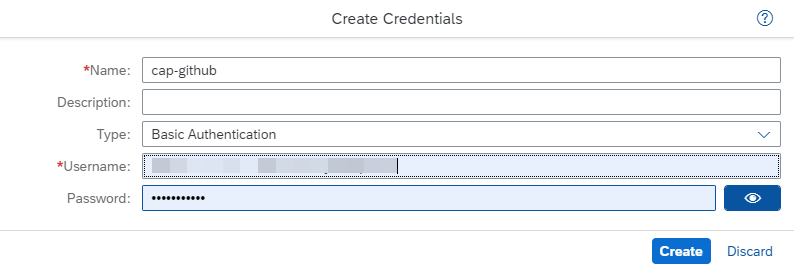
   

## Configure your SAP BTP credentials
To create credentials for deploying to SAP BTP, go to the Credentials tab and choose + (Create Credentials).
- Enter a name for your credential, which is unique in your SAP BTP subaccount.
- As type select *Basic Authentication* 
- For Username and password, enter your username and password for the SAP BTP cockpit
- Click on create
  
    

>Note, if you choose other credential name then our example, you need to make the changes in pipline config.yml as well.

## Configure a CI/CD job
- In the Jobs tab in SAP Continuous Integration and Delivery, choose ( + ) to create a new job.
  
- For Job Name, enter a freely chosen name for your job, which is unique in your SAP BTP subaccount and Under Repository, choose Add Repository.
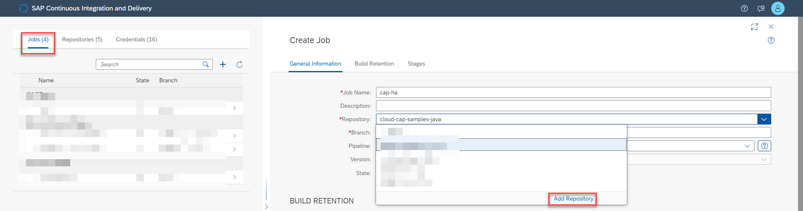

- Add the name and the URL for your repository and select the github credentials created in previous step.
- Choose Add

    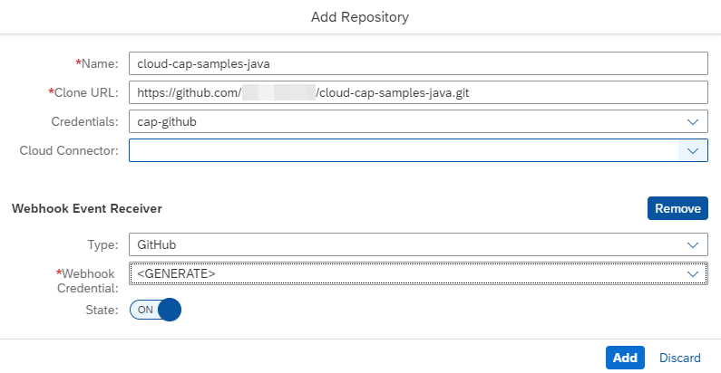

-   For Branch, enter the GitHub branch of your repository from which you want to receive push events.  In this example, the name of the branch is **main**
-   As Pipeline, choose SAP Cloud Application Programming Model.
-  keep other sections as default and scroll down to Release section, switch the excution of the Deploy to Cloud Foundry Space step on.
-  Specify the API Endpoint, Org Name, Space and Credentials.

   (Hint: You can get the values from your subaccount overview in the SAP BTP cockpit)

    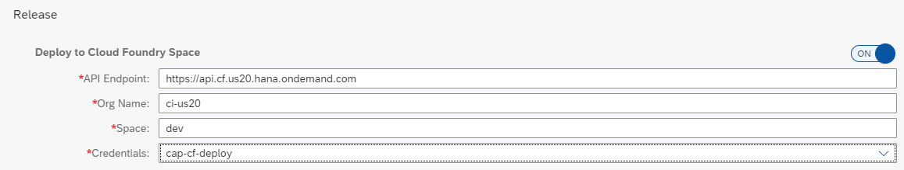

- Leave the Upload to Cloud Transport Management step switched off. will do this later
- Choose Create.

## Create a GitHub webhook

GitHub webhooks allow you to automate CI/CD builds. Whenever you push changes to your GitHub repository, a webhook push event is sent to the service to trigger a build of the connected job.

To create a webhook in GitHub, you need Payload URL and Secret.
- Choose the name of your repository and choose Webhook Data.   
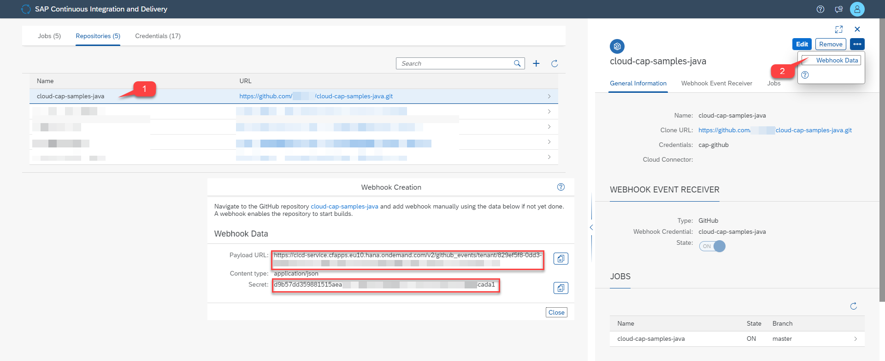

- In your project in GitHub, go to the Settings tab, choose Webhooks and Add webhook
  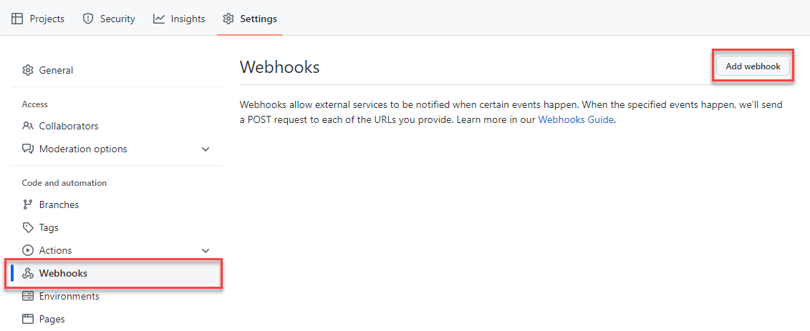

- Enter the Payload URL, Content type, and Secret from the Webhook Data in SAP Continuous Integration and Delivery. For all other settings, leave the default values.
  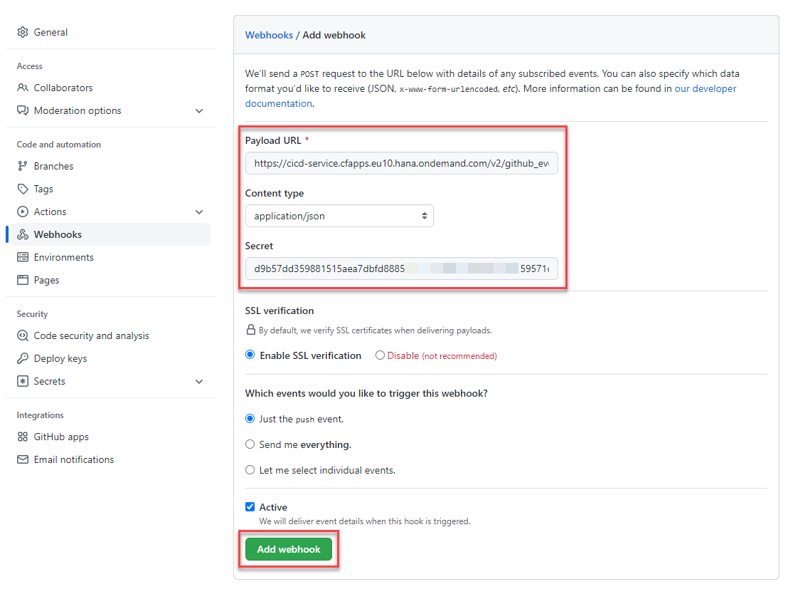  
- Choose Add webhook.

## Verify your build
You have to trigger your job manually the first time after creation.

- In the Jobs tab of SAP Continuous Integration and Delivery, select your job and choose Trigger Build.
Note: Make sure mta changes and other changes are checked in before triggering the Build
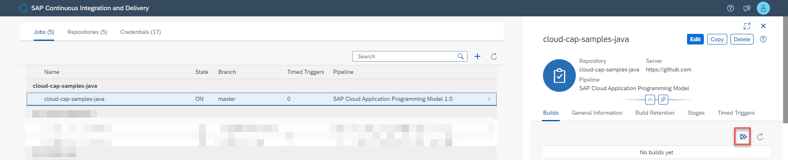 

- If you would like to check whether the job is triggered automatically after new changes, you can make a simple change in the code and verify if it’s built.
  
- Wait until the job has finished and verify that the build tile is marked as successful.
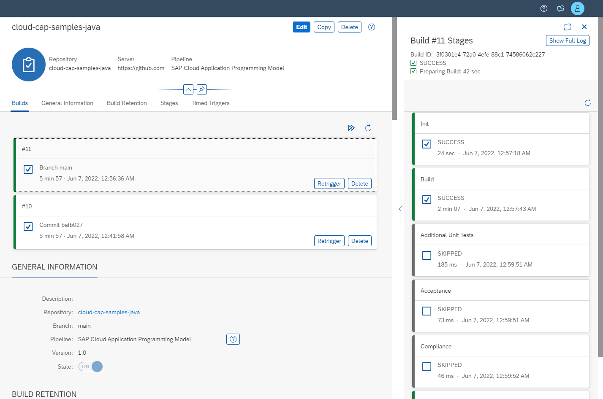

- Navigate to your space in the SAP BTP Cockpit and check the list of installed applications. Now, you have a bookshop-app application and a bookshop-srv application.
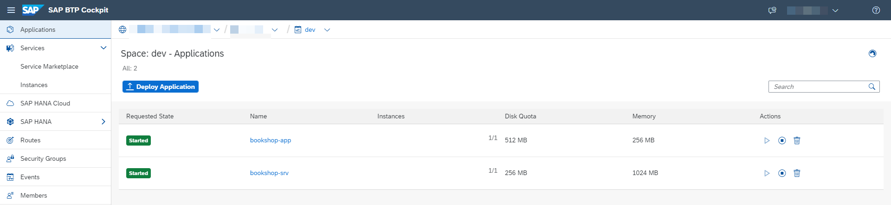

You have now successfully created a CI/CD pipeline and deployed your application to SAP BTP.
