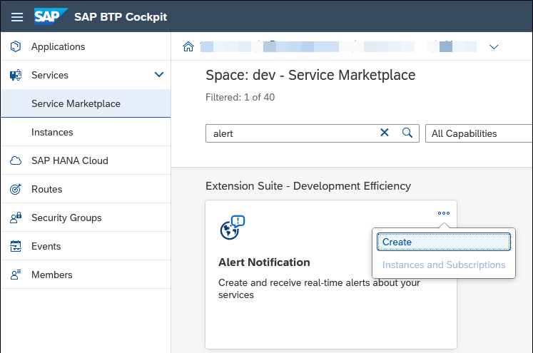
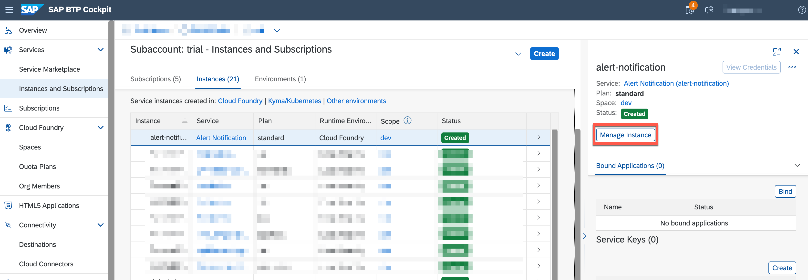
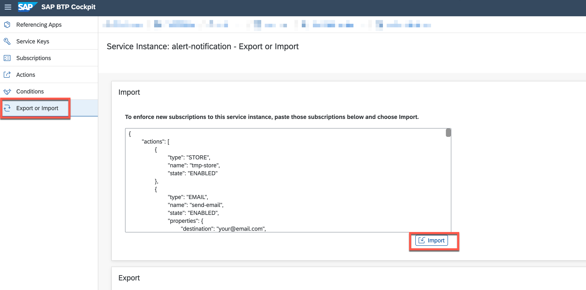
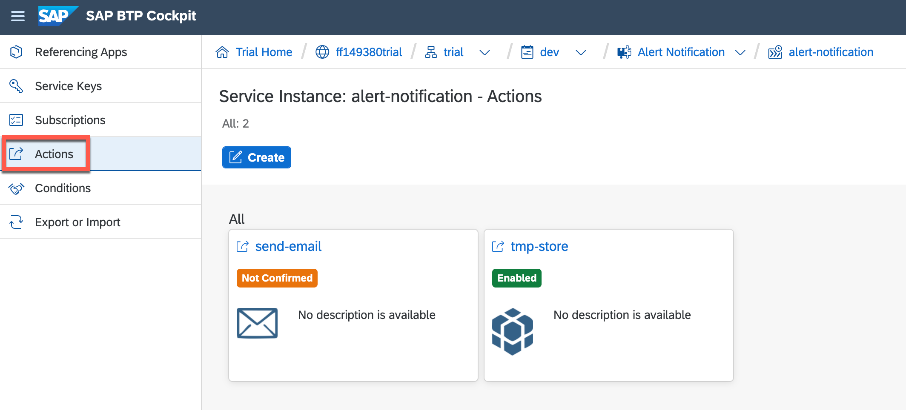
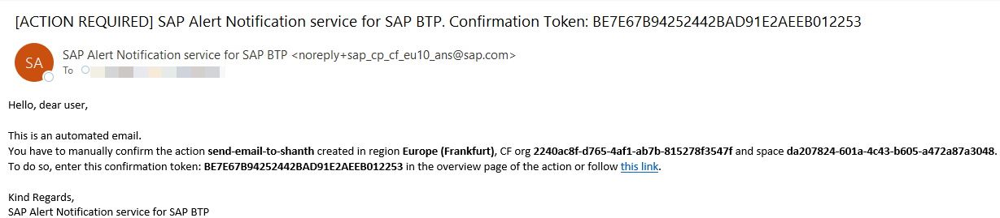
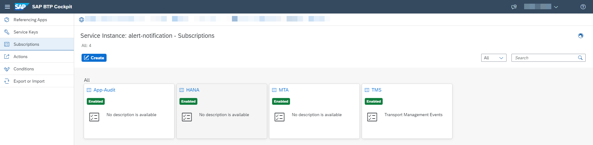
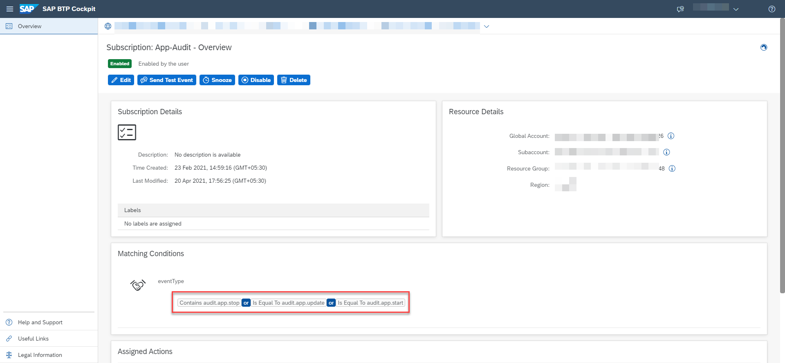

# Configure SAP Alert Notification service for SAP BTP

### You will learn
- How to enable SAP Alert Notification service
- How to configure a SAP Alert Notification service for different Service Availability Notifications
- Service offers a variety of Built-In Events. The complete list can be found here

For this scenario you will define the following alerts:
Application Events - get notifications when an application crashes, a process crashes or alike
Multitarget Application Events - get notified when the deployment or removal of a specific multi-target application has been initiated
SAp HANA Cloud Database alerts - get notified based on the alert definitions configured in SAP HANA Cloud. 


> ### Prerequisites
> - Entitlement for SAP Alert Notification

## Enable SAP Alert Notification service

-   Navigate to the Service Marketplace and create a new service instance for the Alert Notification service.
    

- Provide a service instance name (e.b. alert-notification) and continue with **Create**.
    

## Configuration Management
This section provides information about how you can manage actions, conditions and subscriptions within SAP Alert Notification service, so that the service will be configured to know what your events of interest are and how to deliver them. You can do this using different approaches. I am going to use the approach of Exporting or Importing Configurations

- Select the newly created instance and click on **Manage Instance** to navigate the to Alert Notification service cockpit.


- Navigate to **Export and Import**, copy and paste the below configuration JSON. **Replace `<your@email.com>`** with your email, where you want to receive the notifications.


    ```json
            {
            "actions": [
                {
                    "type": "EMAIL",
                    "name": "send-email",
                    "state": "ENABLED",
                    "properties": {
                        "destination": "your@email.com",
                        "useHtml": "false"
                    }
                },
                {
                    "type": "STORE",
                    "name": "tmp-store",
                    "state": "ENABLED"
                }
            ],
            "conditions": [
                {
                    "name": "Audit-App-Crash",
                    "mandatory": false,
                    "propertyKey": "eventType",
                    "predicate": "EQUALS",
                    "propertyValue": "app.crash",
                    "labels": [],
                    "description": ""
                },
                {
                    "name": "Audit-App-Update",
                    "mandatory": false,
                    "propertyKey": "eventType",
                    "predicate": "EQUALS",
                    "propertyValue": "audit.app.update",
                    "labels": [],
                    "description": ""
                },
                {
                    "name": "mta-category",
                    "mandatory": false,
                    "propertyKey": "category",
                    "predicate": "EQUALS",
                    "propertyValue": "NOTIFICATION",
                    "labels": [],
                    "description": ""
                },
                {
                    "name": "Audit-App-Stop",
                    "mandatory": false,
                    "propertyKey": "eventType",
                    "predicate": "CONTAINS",
                    "propertyValue": "audit.app.stop",
                    "labels": [],
                    "description": ""
                },
                {
                    "name": "Audit-App-Process-Crash",
                    "mandatory": false,
                    "propertyKey": "eventType",
                    "predicate": "EQUALS",
                    "propertyValue": "audit.app.process.crash",
                    "labels": [],
                    "description": "audit.app.process.crash"
                },
                {
                    "name": "Audit-App-Start",
                    "mandatory": false,
                    "propertyKey": "eventType",
                    "predicate": "EQUALS",
                    "propertyValue": "audit.app.start",
                    "labels": [],
                    "description": ""
                },
                {
                    "name": "mta-deployment",
                    "mandatory": false,
                    "propertyKey": "eventType",
                    "predicate": "EQUALS",
                    "propertyValue": "DEPLOYMENT",
                    "labels": [],
                    "description": ""
                },
                {
                    "name": "mta-undeployment",
                    "mandatory": false,
                    "propertyKey": "eventType",
                    "predicate": "EQUALS",
                    "propertyValue": "UNDEPLOYMENT",
                    "labels": [],
                    "description": ""
                },
                {
                "name": "HANA-Notification",
                "mandatory": false,
                "propertyKey": "eventType",
                "predicate": "STARTS WITH",
                "propertyValue": "HDB",
                "labels": [],
                "description": ""
                }
            ],
            "subscriptions": [
                {
                "name": "MTA",
                "conditions": [
                    "mta-deployment",
                    "mta-undeployment"
                ],
                "actions": [
                    "tmp-store",
                    "send-email"
                ],
                "state": "ENABLED"
                },
                {
                "name": "App-Audit",
                "conditions": [
                    "Audit-App-Process-Crash",
                    "Audit-App-Stop",
                    "Audit-App-Crash",
                    "Audit-App-Update"
                ],
                "actions": [
                    "tmp-store",
                    "send-email"
                ],
                "state": "ENABLED"
                },
                {
                    "name": "HANA",
                    "conditions": [
                        "HANA-Notification"
                    ],
                    "actions": [
                        "tmp-store",
                        "send-email"
                    ],
                    "state": "ENABLED"
                }
            ]
        }
        ```
- Select **Import** to finish the configuration import. 

-  After the import process has finished, you will find two actions in your Alert Notification cockpit:
   - *send-email*: sends e-mail when an alert gets raised happens
   - *tmp-store*: stores the alert temporary in the service. Later it can be accessed e.g. via SAP Cloud ALM
   

    >There are much more notification channels like Slack, Microsoft Teams and many more. The full list can be found [here](https://help.sap.com/viewer/5967a369d4b74f7a9c2b91f5df8e6ab6/Cloud/en-US/8a7e092eebc74b3ea01d506265e8c8f8.html). You can follow the documentation to configure further actions.

- A confirmation token will be sent to the email address. Click on the provided link or copy that value and use it to confirm the action as shown in the next sub-step.

- To receive notifications about relevant events by the SAP Alert Notification service for SAP BTP, you need subscriptions to these alerts.
   You have defined Subscriptions while importing the configuration:
   

- Open one of the above mentioned Subscriptions e.g. *App Audit* and check the conditions when the alert will be triggered. 
   

   Whenever one of following conditions will be matched, an alert notification will be triggered. 
   - application stops
   - application crashes
   - application process crashes
   - application gets updated

- For application events, you need to add the respective existing technical users according to their relevant data center. This user must have the **SpaceAuditor** permission. Add the user to the Cloud Foundry space of your SAP BTP subaccount by using its e-mail address.
   
   - The list of technical users depending on the data center can be found [here](https://help.sap.com/viewer/5967a369d4b74f7a9c2b91f5df8e6ab6/Cloud/en-US/4255e6064ea44f20a540c5ae0804500d.html) 
  
- To test the alert notification, trigger an event for app audit. You can manually stop the application, which will trigger the event and notify you via e-mail.

You have now successfully created a SAP Alert Notification service and configured different conditions for notification.