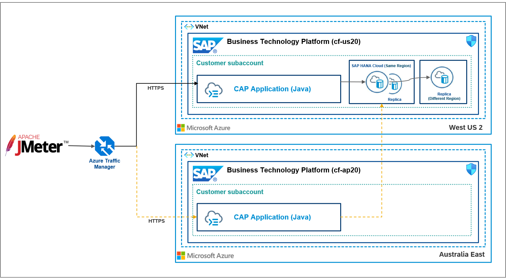
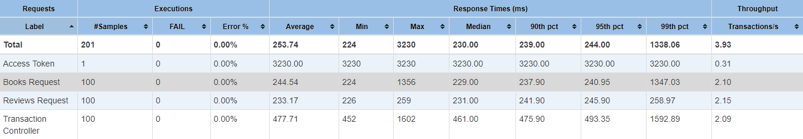
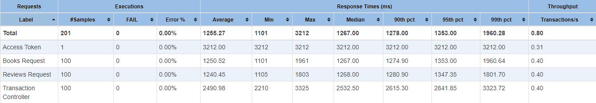

# Performance Test results between regions

The following performance tests are executed sequentially 100 times with a single thread using JMeter.
###Landscape

### Request from India South to US West 

[more details](https://htmlpreview.github.io/?https://raw.githubusercontent.com/SAP-samples/cap-distributed-resiliency/SAP-HANA-Cloud/tutorial/11-Performance%20Test/us/index.html)
### Request from India South to Australia East (Failover scenario)

[more details](https://htmlpreview.github.io/?https://github.com/SAP-samples/cap-distributed-resiliency/blob/SAP-HANA-Cloud/tutorial/11-Performance%20Test/ap/index.html)
